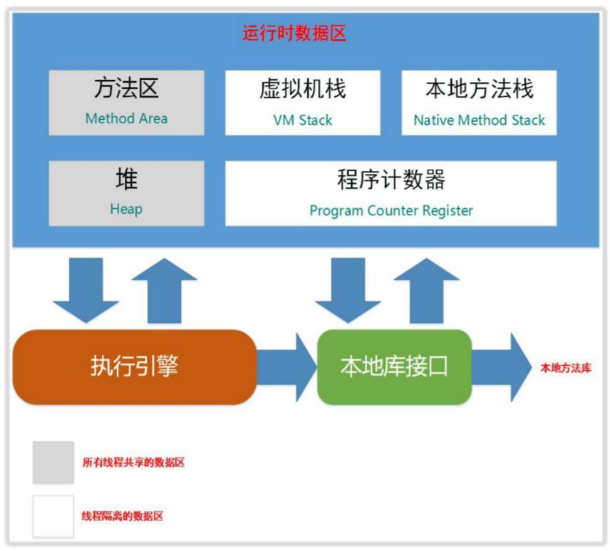
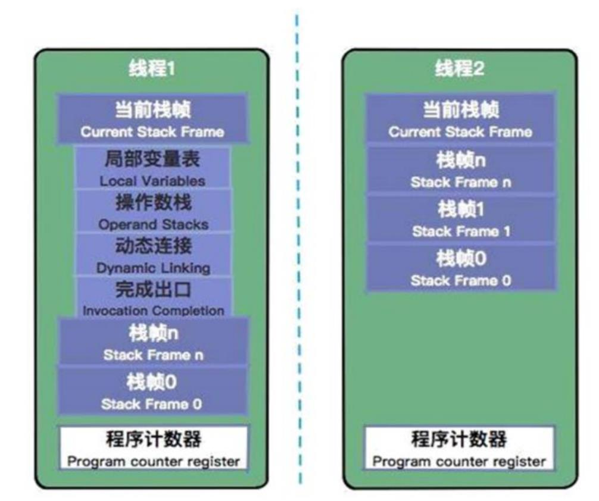
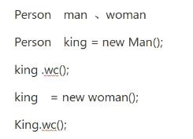

# JVM 概述

Java Virtual Machine，识别 .class 文件并且解析它的命令（字节码，JVM的机器语言），最终使用操作系统上的函数完成操作

.java 编译后 .class 到 ClassLoader 加载进 运行时数据区（JVM管理的内存），然后通过执行引擎执行

每一个进程都有自己一个JVM

# 运行时数据区

定义：Java 虚拟机在执行 Java 程序的过程中会把它所管理的内存划分为若干个不同的数据区域

类型：

堆区（所有线程共享的数据区）：Java堆、方法区 （运行时常量池）

栈区（线程隔离数据区）：程序计数器、虚拟机栈、本地方法栈

直接内存

Java 解释执行是栈（操作数栈） -- 兼容性好，效率偏低

C 是寄存器（硬件）-- 运算快，移植性差

# 程序计数器

指向当前线程正在执行的字节码指令的地址，即每个线程都有一个属于自己的程序计数器

存在理由：因为操作系统的时间片轮转，确保JVM的正确执行

JVM内存区域中唯一不会OOM

# 虚拟机栈（Java栈）

栈：FILO先进后出

存储当前线程运行方法所需的数据，指令，返回地址

虚拟机栈：对物理地址的虚拟化

栈帧：一个方法一个栈帧

- 局部变量表（方法里的局部变量，只能存储8大基础类型 + 引用）
- 操作数栈（存放方法的执行、操作）
- 动态链接（Java多态，静态分派，动态分派）
- 完成出口（返回地址）正常返回通过程序计数器中的地址，异常返回通过异常处理表

动态链接、完成出口和程序计数器统称为栈帧信息

# 本地方法栈

保存 native 方法信息

当一个 JVM 创建的线程调用 native 方法后，JVM 不再为其在虚拟机栈中创建栈帧，JVM 只是简单地动态链接并直接调用 native 方法

虚拟机规范无强制规定，各版本虚拟机自由实现 

HotSpot 直接把本地方法栈和虚拟机栈合二为一

# 方法区

类信息，常量，静态变量，即时编译器编译后的代码

方法区的实现：

- JDK1.7 及以前 永久代 划分和堆有关系，一般内存大小受限于堆的大小，会发生 OOM
- JDK1.8 元空间 可以使用机器内存（堆外内存），内存使用不受限制

元空间 -- 好处：方便扩展。坏处：挤压堆空间

使用元空间的历史：Oracle 收购 Hotspot（永久代 + 元空间） 和 JRocket（没有永久代）合并，永久代会发生 OOM

类卸载、类会在什么时候回收：

- 类所有的实例都回收掉
- 加载该类的 classloader 已经被回收
- 该类 java.lang.class 对象没有任何地方被引用，无法通过反射访问该类的方法
- JVM 参数设置没有禁用类的回收

# Java 堆

对象实例（几乎所有），数组

**为什么要区分堆和方法区？**
堆：对象，数组，频繁回收
方法区：不需要频繁回收

连续的内存空间（从Eden，From，To，一直连续到Tenured）

# 直接内存（堆外内存）

不是虚拟机运行时数据区的一部分，也不是Java虚拟机规范中定义的内存区域

- 如果使用了 NIO，这块区域会被频繁使用，在Java堆内可以用directByteBuffer对象直接引用并操作；
- 这块内存不受 Java 堆大小限制，但受本机总内存的限制 ，可以通过 MaxDirectMemorySize来设置（默认与堆内存最大值一样），所以也会出现 OOM 异常。

# 从底层深入理解运行时数据区

1. 申请内存，确定堆、栈、方法区内存空间大小
2. 类加载 --> class 进入方法区
3. 运行时静态变量，常量设置进方法区
4. 创建虚拟机栈，压入栈帧
5. 栈帧方法执行（对象在堆创建，引用放在局部变量表，对象在多次回收后从Eden区到From和To最后到老年代）

# 深入辨析堆和栈

功能：

- 以栈帧的方式存储方法调用的过程，并存储方法调用过程中基本数据类型的变量（int、short、long、byte、float、double、boolean、char等）以及对象的引用变量，其内存分配在栈上，变量出了作用域就会自动释放；
- 而堆内存用来存储Java中的对象。无论是成员变量，局部变量，还是类变量，它们指向的对象都存储在堆内存中。

线程独享还是共享：

- 栈内存归属于单个线程，每个线程都会有一个栈内存，其存储的变量只能在其所属线程中可见，即栈内存可以理解成线程的私有内存；
- 堆内存中的对象对所有线程可见。堆内存中的对象可以被所有线程访问。

空间大小：

- 栈的内存要远远小于堆内存，栈的深度是有限制的，可能发生StackOverFlowError问题

# 内存溢出

- 栈溢出
- 堆溢出
- 方法区溢出
- 本机直接内存溢出

# 虚拟机优化技术

编译优化技术：方法内联

栈的优化技术：栈帧之间数据共享（A方法调用那个B方法，B返回局部变量的值，B的局部变量表和A的操作数栈共享）

# 常量池内存位置

JDK1.8 运行时的常量池和静态常量放在元空间，字符串部分在堆