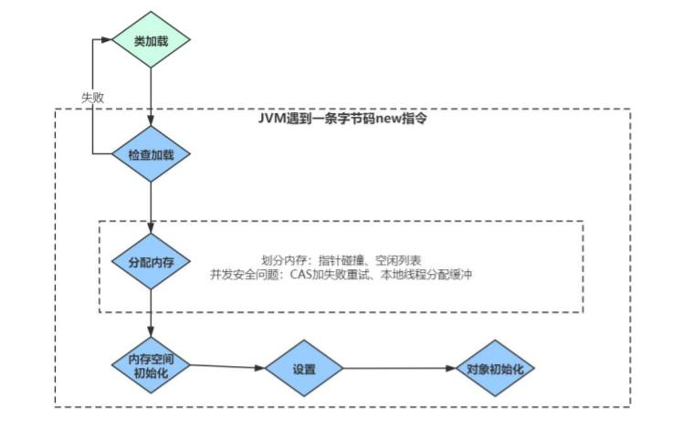
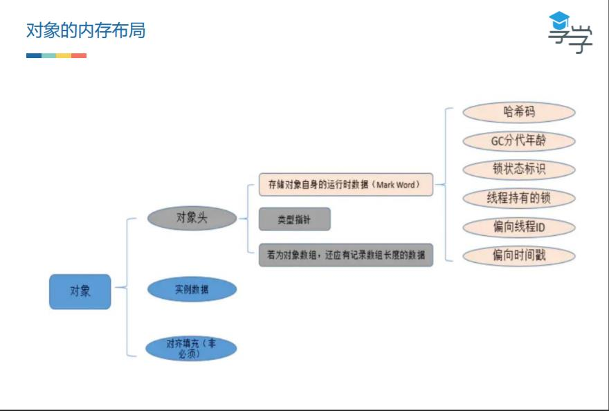
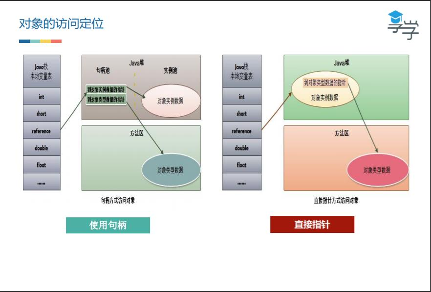
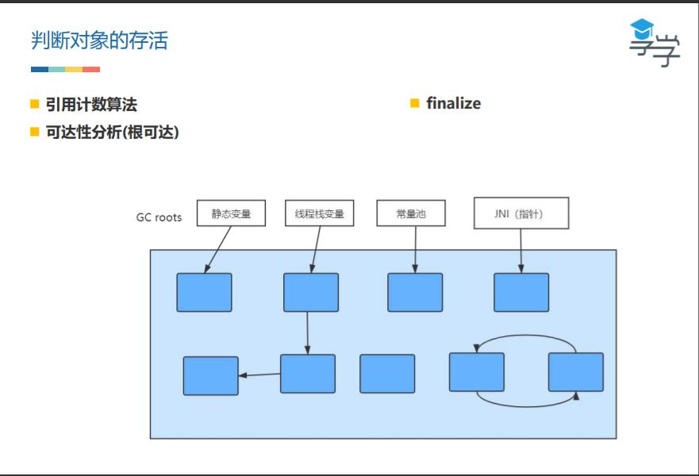
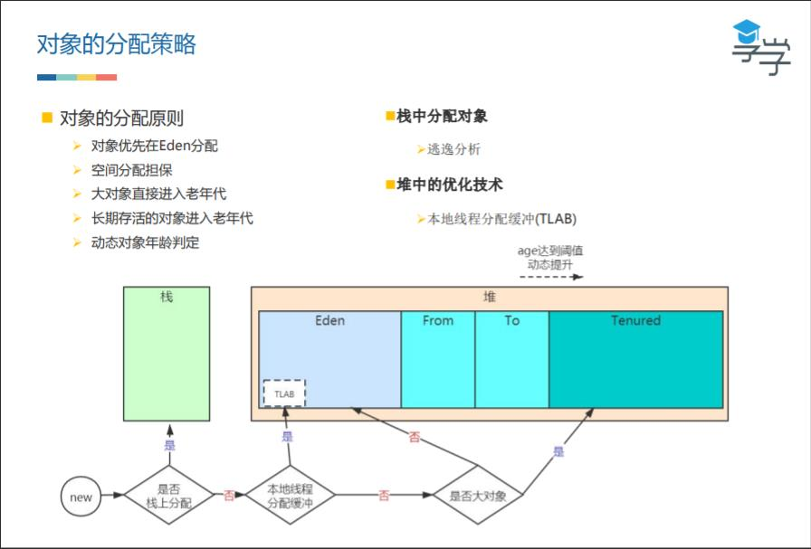
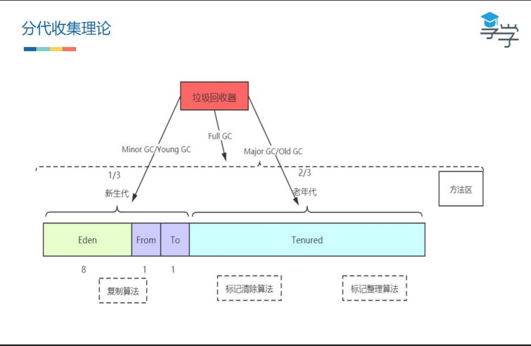
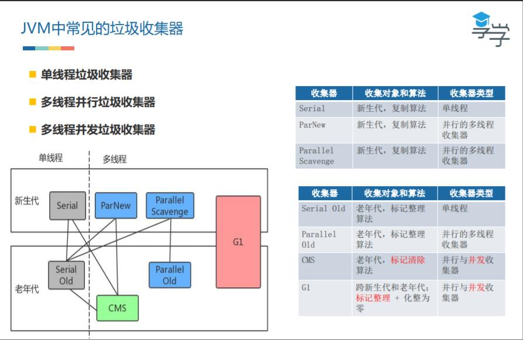
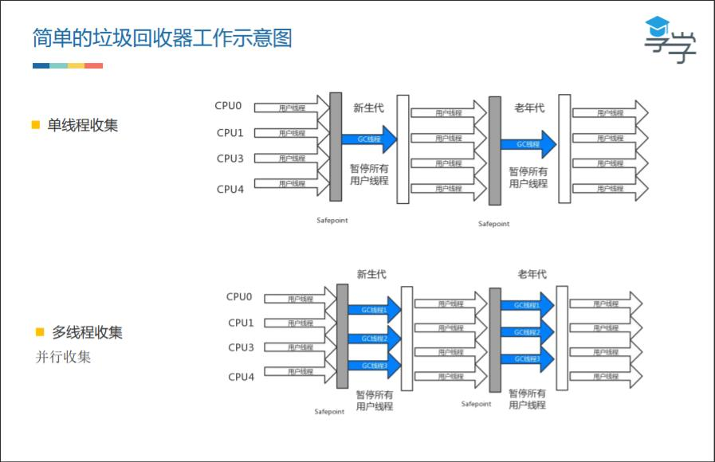
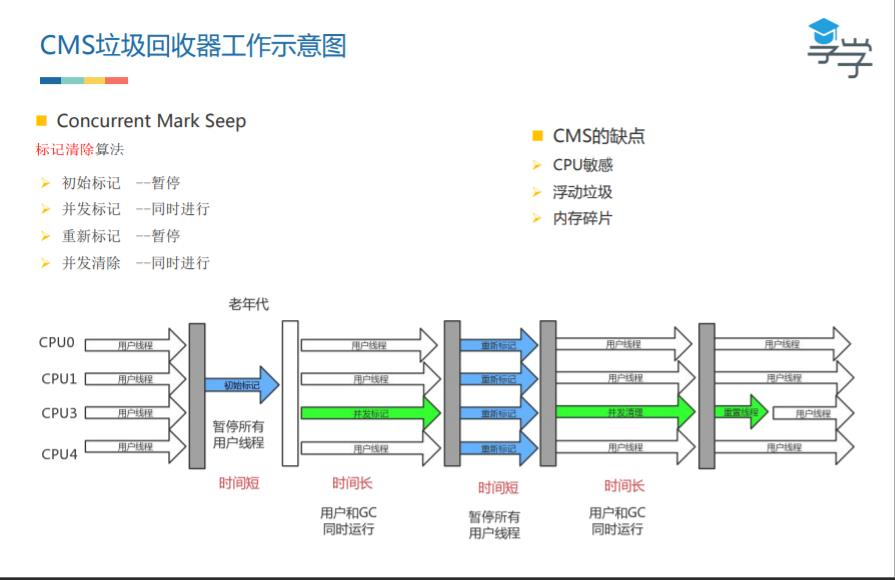
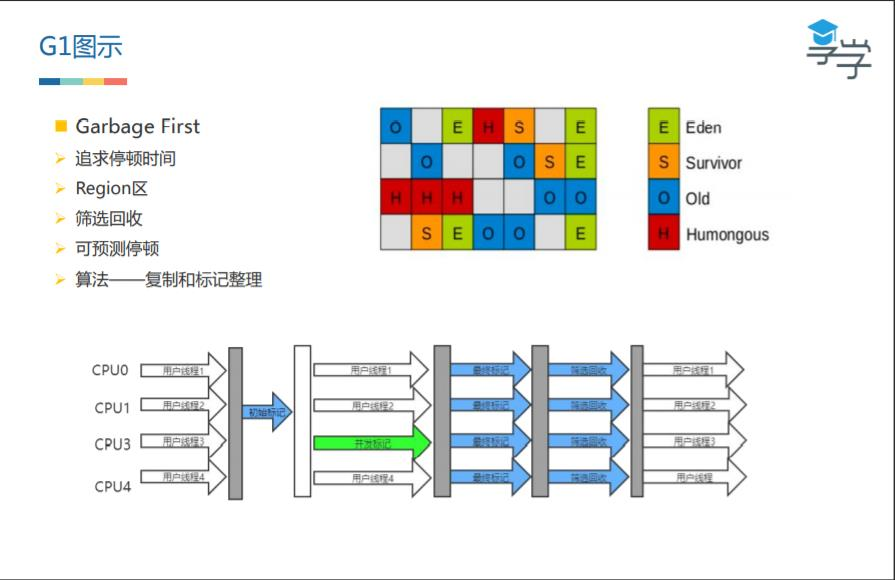

# 对象的创建与垃圾回收机制

## 虚拟机中对象的创建过程

- 类加载：把 class 加载进内存，加载的不一定是文件，也可以通过网络等进行加载
- 检查加载：new 出的对象能不能定位到在常量池所在方法区里面类的符号引用
  类的符号引用：用一组符号去描述你说引用的对象
- 分配内存（分配方式取决于堆内存的规整情况）：堆空间使用是连续规整的情况下，指针在分配内存后的移动对象大小叫做指针碰撞；对空间剩余内存零散不规整，无法进行指针碰撞，则通过根据空间列表进行内存分配（对象占据内存一定是连续的）
  可能多线程创建对象，并发安全问题（通过 JVM 参数设置选择开启，默认开启本地线程分配缓冲 TLAB）：CAS加载失败重试（原子操作）；本地线程分配缓冲，相当于 ThreadLocal，会在 Eden 区为每个线程划分一个区域（本地线程分配缓冲 TLAB），线程创建的对象会直接在线程对应的区域进行创建，如果线程所占空间不够，还会继续再划分一块空间（Eden区满了会拓展，拓展失败就 OOM）
- 内存空间初始化：把数据设为零值，例如：int = 0，boolean = false
- 设置：设置对象头
- 对象初始化：调用构造方法

## 对象的内存布局

在 Hotspot 对象分为：对象头，实例数据，对齐填充（非必选）

类型指针：对应哪个类的类型

## 对象的访问定位

1. 使用句柄（优点：如果对象移动了内存地址，句柄池的内存地址不需要变；缺点：需要二次映射查找，加大开销）
2. 直接指针（直接指向对象实例数据的内存地址）

## 判断对象的存活

引用计数法：存在的问题相互引用，需额外解决

可达性分析（根可达）：来判定对象是否存活的。这个算法的基本思路就是通过一系列的称为“GC Roots”的对象作为起始点，从这些节点开始向下搜索，搜索所走过的路径称为引用链（Reference Chain），当一个对象到GC Roots没有任何引用链相连时，则证明此对象是不可用的，会被回收。

作为GC Roots的对象包括下面几种：

- 虚拟机栈（栈帧中的本地变量表）中引用的对象。
- 方法区中类静态属性引用的对象。
- 方法区中常量引用的对象。
- 本地方法栈中JNI（即一般说的Native方法）引用的对象。
- JVM的内部引用（class对象、异常对象NullPointException、OutofMemoryError，系统类加载器）。
- 所有被同步锁(synchronized关键)持有的对象。
- JVM内部的JMXBean、JVMTI中注册的回调、本地代码缓存等
- JVM实现中的“临时性”对象，跨代引用的对象（在使用分代模型回收只回收部分代时）

Class 类被回收的条件：条件比较苛刻，必须同时满足以下的条件（仅仅是可以，不代表必然，因为还有一些参数可以进行控制）

1. 该类所有的实例都已经被回收，也就是堆中不存在该类的任何实例。

2. 加载该类的ClassLoader已经被回收。

3. 该类对应的java.lang.Class对象没有在任何地方被引用，无法在任何地方通过反射访问该类的方法。

4. JVM 参数设置禁用类的垃圾收集关闭

    

Finalize：即使通过可达性分析判断不可达的对象，也不是“非死不可”，它还会处于“缓刑”阶段，真正要宣告一个对象死亡，需要经过两次标记过程，一次是没有找到与GCRoots的引用链，它将被第一次标记。随后进行一次筛选（如果对象覆盖了finalize），我们可以在finalize中去拯救。

Finalizer是单独一个线程在跑（守护线程），方法优先级很低，需要等待一段时间

## 各种引用

强引用：Object obj=new Object();

软引用（SoftReference）：不会受GC影响，只有当内存不足时OOM才会回收，做缓存

弱引用（WeakReference）：GC到来时回收，处理Activity的内存泄漏

虚引用（PhantomReference）：GC回收时可得到一个通知，虚引用是不会单独使用的，构造虚引用需要把虚引用对象（即普通对象）用引用队列管理，在引用队列中，该对象在队列中为null，直到GC后对虚引用回收的信息绑定进虚引用的对象，检测GC是否正常工作

## 对象分配策略

逃逸分析对象不会在栈外使用的话，会使用栈上分配

本地线程分配缓冲 TLAB 是为了解决对象在分配内存阶段多线程创建对象的并发安全问题

空间担保是为了每次在老年代中创建对象不需要都GC，From 和 To 满了的话还有对象存进则直接存放到老年代

## 分代收集理论

1. 绝大部分对象都是朝生夕死 -- 新生代
2. 对象在多次垃圾回收后还存活，会越来越难回收 -- 老年代

任何一个区域满了就会触发 GC

## 复制算法（Copying）

特点：

- 实现简单，运行高效
- 内存复制，没有碎片
- 利用率只有一半

Eden 区的来源：

- appel 式来回收
- 提高空间利用率和空间分配担保

## 标记 - 清除算法（Mark-Sweep）

特点：

- 执行效率不稳定（对象太多的话标记清除会很耗时）
- 内存碎片导致提前 GC

## 标记 - 整理算法（Mark - Compact）

特点：

- 对象移动（老年代大部分对象可能要被移动）
- 引用更新
- 用户线程暂停
- 没有内存碎片

## JVM 常见的垃圾收集器

并行：多线程的垃圾收集器，可以启动多个线程来进行垃圾回收，但用户所有线程得停止

并发：垃圾回收器的线程和用户的线程可以同时工作

采用 CMS 最大响应时间，即所有用户线程暂停的时间比较短

CPU 敏感：会占用线程进行并发标记和并发清除

浮动垃圾：并发清除阶段还是会产生垃圾，只能等下次垃圾收集，浮动垃圾太多的话会切换为 Serial Old 垃圾回收算法

内存碎片：因为采用的是标记清除算法而不是标记整理算法，碎片太多也会切换为 Serial Old 算法

G1 和 CMS 区别：

- 堆没有划一大块的Eden、From、To和老年代，而是通过系统划分内存大小再进行标记
- 筛选回收：JVM 的最小暂停时间，即可预测停顿
- 两个Region之间是基于标记整理算法，CMS 是标记清除

Region 区把碎片化整

内存大的情况下 G1 才有优势

## Stop The World

无论使用任何一种垃圾收集器都会 stw

用户线程跑的时候需要都停下来等待 GC

如果不停止所有用户线程，垃圾会收集清理不干净

突然就会卡顿

## 面试题

### 什么情况下内存栈溢出

- 无限递归
- 不断创建线程，创建一个栈会占用一个内存空间

### final、finally和finalize

final 修饰类无法被人继承，效率；修饰变量会变成常量，赋值一次不能更改

finally try 中return后finally的方法也会执行

finalize 方法，可以拯救一个对象