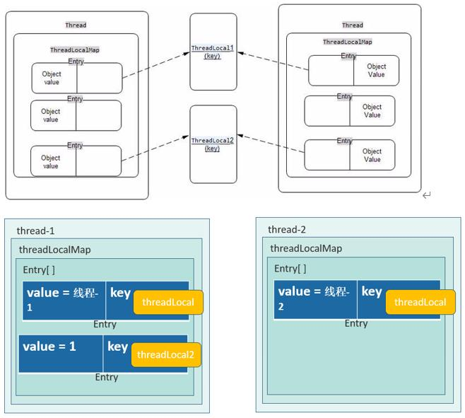

# 并发编程


## 进程和线程之间的关系

- 应用程序是死的（即程序存放在硬盘中），进程是活的
- 进程是操作系统进行资源分配的最小单位
- 线程是CPU调度的最小单位，必须依赖于进程而存在，一个进程至少要有一个线程，线程是共享进程的资源


## 时间片轮转机制

一般情况下CPU可以开启的线程数等于CPU物理核心数，但Intel出现了超线程技术变为1:2

操作系统提供了时间片轮转机制，即RR调度，使得程序可以创建比CPU核心线程数多的线程

将时间进行切片，每一片执行一段进程的指令，但不同进程执行会进行上下文切换


## 并行和并发

并行：同时进行的任务数

并发：在一个时间单位内多个线程所进行的任务数，也就是说时间片轮转机制是并发机制的一种算法


## 高并发的利弊

- 充分利用CPU资源
- 加快用户响应时间
- 使代码异步化，模块化，简单化
- 线程的安全性，因为线程是共享进程的资源，加锁的话可能出现死锁，会出现线程争夺进程资源的性能问题
- 操作系统对一个进程创建的线程数有限制，Linux一个进程1000个线程，Windows一个进程2000个线程，分配一个线程需要一个栈空间，因为创建一个线程会消耗大量资源


## 新起线程的方式

2种，在Thread的注释有说明

- 类Thread，覆盖run()
- 接口Runnable，重写run()，传进Thread的构造函数

区别：

- Thread对线程的抽象
- Runnable对任务的抽象

同一个 Thread 两次 start() 会发生异常，在 start() 首先会判断当前线程的状态，所以 start() 只能被执行一次


## 线程结束

不调用stop()可能导致线程使用的资源被占用无法释放

应调用interrupt()中断方法，设置线程的标志位，只是通知这个线程结束，是否结束的决定权在于线程

线程是协作式

通过 isInterrupted() 和 interrupted() 查询是否发生中断，如果自己写标志可能因为 sleep() 导致无法检测到自己写的标志，而 sleep() 会抛出 interrupted 的异常，即接收 interrupted 发送的标志位修改信息，但是接收到抛出的异常后标志位被修改为不中断，需要手动在异常里释放资源然后调用 interrupt() 方法，区别于 stop() 无法因为 sleep() 无法释放资源

死锁是不会理会中断


## sleep 和 wait 的区别

1. wait只能在同步（synchronize）环境中被调用，而sleep不需要。
2. 进入wait状态的线程能够被notify和notifyAll线程唤醒，但是进入sleeping状态的线程不能被notify方法唤醒。
3. wait通常有条件地执行，线程会一直处于wait状态，直到某个条件变为真。但是sleep仅仅让你的线程进入睡眠状态。
4. wait方法在进入wait状态的时候会释放对象的锁，但是sleep方法不会。
5. wait方法是针对一个被同步代码块加锁的对象，而sleep是针对一个线程。


## 线程进一步认识

yield() 并不会释放锁，只是让出 CPU 的执行权

让两个线程顺序执行 join()

线程有优先级（1~10），优先级是否发挥作用还是由操作系统决定

守护线程：GC，Finalizer，只有当所有用户线程结束，守护线程才会结束，守护线程的 finally 不一定起作用，取决于操作系统，因为用户线程一结束，使用的内存就会被操作系统回收，守护线程一般是管理内存用的

wait() 是 Object 的方法


## 线程间的共享安全性

要保证锁的对象不会发生变化

复合操作 i++ 即是 Integer.valueOf 重新 new Integer()，所以加锁该对象每次锁的对象都不一样


## 死锁的产生条件

- 互斥条件
- 请求保持
- 不剥夺
- 环路等待


## ThreadLocal 实现解析

Thread 成员变量 ThreadLocal.ThreadLocalMap，里面又有 Entry 内部类的成员变量数组

为每个线程提供了一个变量副本，每个线程都访问自身的变量副本

Entry 数组的 key 是弱引用 ThreadLocal




## ThreadLocal 的线程不安全

引发内存泄漏：Entry 是弱引用，ThreadLocal 被回收，但是 value 是强引用没被回收，即 Entry 没有被回收，所以一般用完要 remove()。虽然 ThreadLocal 的 set 和 get 方法不一定执行去检测清除 key 为 null 的  Entry 数组。因为是弱引用和监测机制，所以一般内存泄漏会稳定在一个范围，如果是强引用则一定会发生内存泄漏

线程不安全：因为 ThreadLocal 只是引用了变量，所以静态对象会产生线程不安全，解决方法：去除 static，或者在 ThreadLocal 初始变量的时候指定一个初始值


## 线程间的协程

线程相互配合完成某项工作

wait()，notify()，notifyAll() 都是属于 Object 的方法，都需要在 synchronized 关键字中使用，不然运行会报错

所有阻塞需要有中断异常处理。（eg.wait() 使用需要 try-catch）

```java
// 等待和通知的标准范式
// 等待
sychronized(对象) {
	while(条件不满足) {
		对象.wait() //此时会释放对象锁
	}
	// 业务逻辑
}
// 通知
sychronized(对象) {
	// 业务逻辑，改变条件
	// do sth
    对象.notify()/notifyAll() // 此时不会释放锁，而是要到 sychronized 代码块都执行完才会释放对象锁，然后重新竞争对象锁
    // 因为 notify() / notifyAll() 不会释放锁，所以一般放在 sychronized 代码块最后
}
```


## AQS

用来构建同步组件

Lock 实现原理是 AQS

tryAcquire() 方法尝试拿锁，公平锁非公平锁也实现该方法

重要的成员变量 (int) state 状态，同步状态

同步工具类内部类继承了AQS，用到了模板方法设计模式

AQS 的基本思想 CLH 队列锁

### 面试

1、内部成员变量state用来保存当前的同步状态
2、要自己实现一个同步工具类一定要通过采用它的模板设计模式
3、内部本质是CLH队列锁每一个等需要拿锁的线程打包成一个节点，挂到一个链表上，拿锁的线程一一在该链表上挂起，每一个线程会去检测前一个节点的线程是否释放锁，释放锁当前线程就可以拿到锁
（公平锁的实现）

是用来构建锁或者其他同步组件的基础框架，比如ReentrantLock、ReentrantReadWriteLock和CountDownLatch就是基于AQS实现的。它使用了一个int成员变量表示同步状态，通过内置的FIFO队列来完成资源获取线程的排队工作。它是CLH队列锁的一种变体实现。它可以实现2种同步方式：独占式，共享式（读锁）。

AQS的主要使用方式是继承，子类通过继承AQS并实现它的抽象方法来管理同步状态，同步器的设计基于模板方法模式，所以如果要实现我们自己的同步工具类就需要覆盖其中几个可重写的方法，如tryAcquire、tryReleaseShared等等。

这样设计的目的是同步组件（比如锁）是面向使用者的，它定义了使用者与同步组件交互的接口（比如可以允许两个线程并行访问），隐藏了实现细节；同步器面向的是锁的实现者，它简化了锁的实现方式，屏蔽了同步状态管理、线程的排队、等待与唤醒等底层操作。这样就很好地隔离了使用者和实现者所需关注的领域。

在内部，AQS维护一个共享资源state，通过内置的FIFO来完成获取资源线程的排队工作。该队列由一个一个的Node结点组成，每个Node结点维护一个prev引用和next引用，分别指向自己的前驱和后继结点，构成一个双端双向链表。


## CLH 队列锁

所有要拿锁的线程都被打包成一个 QNode，共有三个成员变量：当前线程本身，前驱结点（myPred），是否被锁（locked），每个节点都在不停自旋判断前面的结点有没有释放锁（locked字段是否变为false）

AQS 是优化了 CLH 队列锁，改进点有：

1. AQS 是双向链表
2. AQS 如果自旋两次还没拿到锁，线程会进入阻塞


## JMM 内存模型（Java 内存模型）

抽象出工作内存（CPU寄存器，Cache，主内存一部分即内存条一部分），主内存真实内存存储范围也只是个抽象概念，可能在CPU寄存器，Cache，主内存中

eg：操作一个变量，变量会在主内存中创建，操作的线程会将使用的变量从主内存复制到自己独享的工作内存中，每个线程对这个变量的操作只会操作自己工作内存中的这个副本

导致的问题：

1. 可见性：可见性是指当多个线程访问同一个变量时，一个线程修改了这个变量的值，其他线程能够立即看得到修改的值。
2. 原子性

解决：volatile 抑制重排序，只能保证可见性，但是不能解决原子性，因为可能上下文切换，都能解决的是加锁 sychronized


## CAS无锁编程的原理

使用当前的处理器基本都支持CAS()的指令，只不过每个厂家所实现的算法并不一样，每一个CAS操作过程都包含三个运算符：一个内存地址V，一个期望的值A和一个新值B，操作的时候如果这个地址上存放的值等于这个期望的值A，则将地址上的值赋为新值B，否则不做任何操作。

CAS的基本思路就是，如果这个地址上的值和期望的值相等，则给其赋予新值，否则不做任何事儿，但是要返回原值是多少。循环CAS就是在一个循环里不断的做cas操作，直到成功为止。

还可以说说CAS的三大问题。

- ABA问题：变量修改后又被修改回去，CPU 认为变量没被修改过
- 开销问题
- 只能修改比较简单的变量


## BlockingQueue

方法成对出现，不是只有阻塞方法

```
非阻塞方法
add() 向队列插入元素，如果队列满了则抛出异常
remove() 从队列取出元素，如果队列没有元素则抛出异常
```

```
非阻塞不抛异常方法
offer() 向队列插入元素，如果队列满了则返回一个 false
poll() 从队列取出元素，如果队列没有元素则返回 null
```

```
阻塞方法
put() 向队列插入元素，如果队列满了则该动作阻塞住
take() 从队列取出元素，如果队列没有元素则该动作阻塞住
```


## 线程池

各个参数的含义

```

```


## Volatile 实现原理

有 volatile 变量修饰的共享变量进行写操作的时候会使用 CPU 提供的 Lock 前缀指令

- 将当前处理器缓存的数据写回到系统内存
- 这个写回内存的操作会使在其他 CPU 里缓存了该内存地址的数据无效

DCL 双重检查锁定，用在单例模式，因为可见性和抑制了重排序


## Sychronize 实现原理

sychronize 实现原理是使用 monitorenter 和 monitorexit 指令实现

monitorenter 在编译后插入到同步代码块开始的位置，monintorexit 是插入到方法结束处和异常处

每个 monitorenter 必须有对应的 monitorexit 与之配对，每个加锁的对象都有对应的monitor对象与其配对，只有拿到monitor对象所有权才能继续执行

jdk1.6之前 sychronize 都是使用重量级锁直接阻塞状态，对于一些轻量级的操作比较耗时

加锁会发生两次上下文切换，第一次拿不到锁挂起，当锁被释放，线程被唤醒进行第二次上下文切换争夺锁，上下文切换会比较耗时

之后对 sychronize 的优化引入了偏向锁、轻量级锁（适应性自旋锁）、重量级锁，如果当前执行加锁的状态都是同一个进程没有竞争，则进入为偏向锁，如果产生竞争则膨胀为轻量级锁，如果轻量级锁自旋到一定次数则膨胀为重量级锁。

还有锁消除（加锁的操作没有竞争，就会取消锁），锁粗化（一段代码加锁，再执行一段没加锁的代码，再执行一段加锁的代码，没加锁的代码执行很快的会被加入到第一段加锁的代码块中，因为锁释放后很快又要竞争锁进行上下文切换消耗CPU资源），逃逸分析（某对象或变量只在某个方法内使用，虚拟机会对这个变量进行优化）

偏向锁：同一个锁总是由同一个线程获得，拿锁过程中会测试是否是第一个拿锁的线程，但是一有竞争就会解锁撤销偏向锁会比较消耗资源，stop the world，因为偏向锁和轻量级锁的对象头数据不一样，一般会取消偏向锁的使用

轻量级锁：通过 CAS 操作来加锁和解锁，使用了一个适应性自旋锁，控制自旋次数JDK1.5之前固定为10次，JDK1.6之后由虚拟机动态进行调整，大概是一个上下文切换的时间