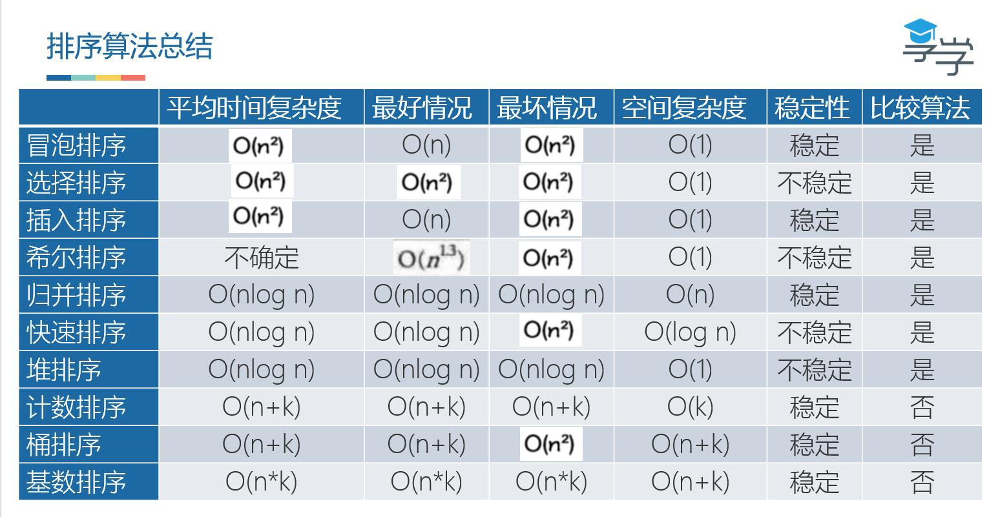

# 链表

1. 从尾到头打印链表
2. 单链表实现约瑟夫环
3. 逆置 / 反转单链表
4. K 个节点为一组进行反转
5. 返回链表中间 1 / 2 节点（扩展返回链表 1 / K 节点）
6. 单链表排序（冒泡，快速）
7. 查找单链表的中间结点，要求只能遍历一次链表
8. 查找单链表的倒数第 K 个节点，要求只能遍历一次链表
9. 删除链表的倒数第 K 个节点
10. 判断单链表是否带环？若带环，求环的长度？求环的入口点？并计算每个算法的时间复杂度 & 空间复杂度
11. 判断两个链表是否相交，若相交，求交点（假设链表不带环）
12. 判断两个链表是否相交，若相交，求交点（假设链表可能带环）
13. 求两个已排序单链表中相同的数据
14. 合并两个有序链表，合并后依然有序

# 数组

1. 数组的查找最大值、最小值、给定值、重复值
2. 数组的排序，快排、归并排序等
3. 多个数组的排序，合并、求交集、求并集

常见优化：

1. 如果数组有序，可以考虑二分法用于优化
2. 如果数组无序，通常使用 Hash 帮助统计

# 栈

1. 实现一个栈，入栈 push、出栈 pop、返回最小值 min 的复杂度为 O(1)
2. 使用两个栈实现一个队列
3. 不借助额外控件实现栈的逆序
4. 实现共享栈
5. 括号的匹配问题

# 队列

1. 使用两个队列实现一个栈
2. BFS 使用队列
3. 滑动窗口

# 堆

1. 10 GB 文件，计算机只有 512 MB 大小的可用内存，如何按照字符串大小，给这个 10 GB 的大文件排序
2. 静态数据求中位数

# 树

1. 判断一棵树是否平衡
2. 求二叉树的深度
3. 二叉树的递归遍历、非递归遍历
4. 二叉树的最大路径和
5. 所有路径的给定和
6. 二叉树的最低公共父节点
7. 求二叉树第 K 层的结点个数
8. 树的层次遍历

# 布隆过滤器

一个网站有 100 亿 URL 存在一个黑名单中，每条 URL 平均 64 字节、这个黑名单要怎么存？若此时随便输入一个 URL，你如何快速判断这个 URL 是否在这个黑名单中？

# LRU Cache

实现一个 LRU 缓存，当缓存达到 N 之后淘汰最近最少使用的数据

# 递归

经典问题：

1. 汉诺塔问题
2. 斐波那契数列
3. 阶乘问题
4. 数组的全排列

常考题：

1. DFS 算法
2. 二叉树的前中后序遍历
3. 归并排序

# 二分查找

局限：

1. 必须依赖有序数组 / 数据
2. 数据量不能太小

易错点：

1. 循环退出条件
2. 每次查找区间一般 mid 的取值
3. 查找区间 left、right 的每次更新情况

常考题：

1. 查找第一个值等于给定值的元素
2. 查找最后一个值等于给定值的元素
3. 查找第一个大于等于给定值的元素
4. 查找最后一个小于等于给定值的元素
5. 旋转数组的二分查找

# 字符串算法

1. 回文子串
2. 字符串分割成子串，子串都是回文串
3. 在字典中查找牟川
4. 实现 Trie 树
5. 各种动态规划

# 贪心算法

1. 分苹果：有 m 个苹果和 n 个孩子（m < n），m 个苹果大小不同，n 个孩子的对苹果大小需求不同，如何分配让最多数量的孩子得到苹果
2. 钱币找零：有 1 元、2 元、5 元、10 元，且张数是 a1，a2，a3，a4，用这些钱来支付 M 元，最少需要多少张？

# 分治算法

1. 二分查找
2. 大整数乘法
3. 合并排序
4. 快速排序
5. 棋盘覆盖
6. 求出一组数据的有序对个数或者逆序对个数
7. 二维平面上有 N 个点，如何快速计算出两个距离最近的点对
8. 有两个 n * n 的矩阵 A、B，如何快速求解两个矩阵的乘积 C = A * B

# 位运算

1. 不用 + - * / 实现加法

注意：

1. 优先级，移位运算法、单目的取反运算符的优先级比比较运算符高，但是 &、|、^、的优先级比比计较运算符低

# 回溯算法

1. 深度优先搜素算法
2. 数独
3. 八皇后问题
4. 0 ~ 1 背包
5. 图的着色
6. 旅行商问题
7. 全排列问题
8. 正则表达式
9. 编译原理的语法分析

# 动态规划

1. 背包问题
2. 计算两个字符串的相似度
3. 最长公共子串长度
4. 求最大递增子序列
5. 最小编辑距离
6. 爬楼梯
7. 连续子数组的最大和
8. 最长回文子串

# 十大排序算法

