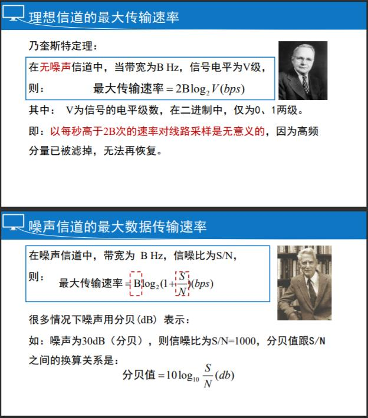
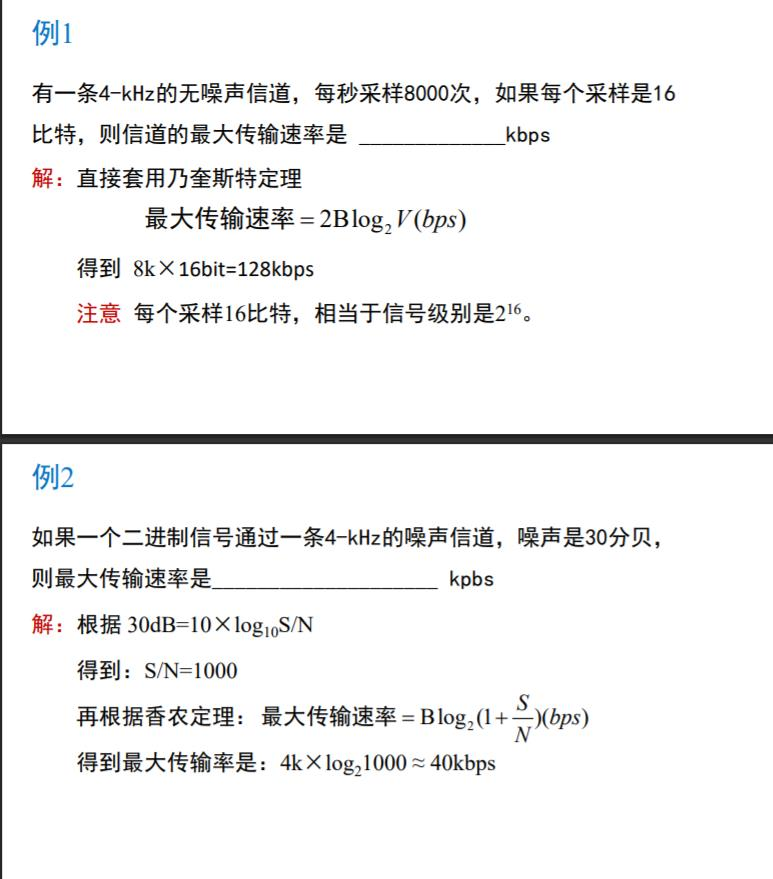
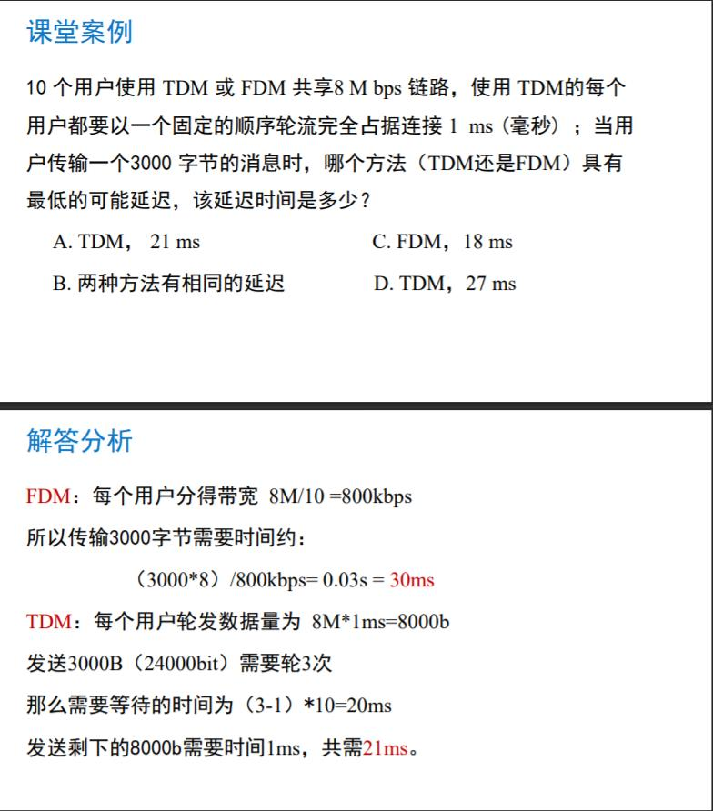
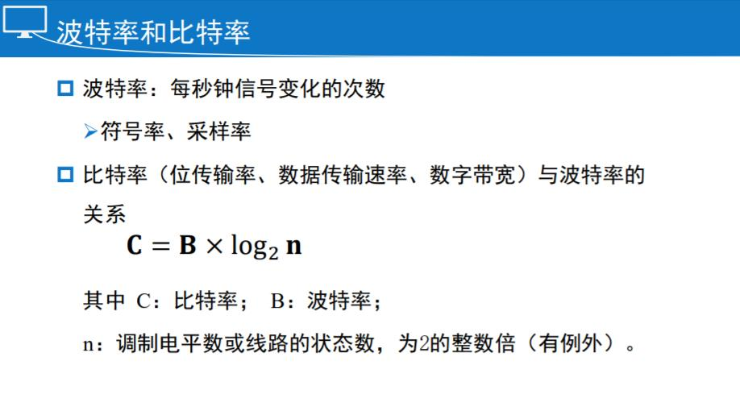
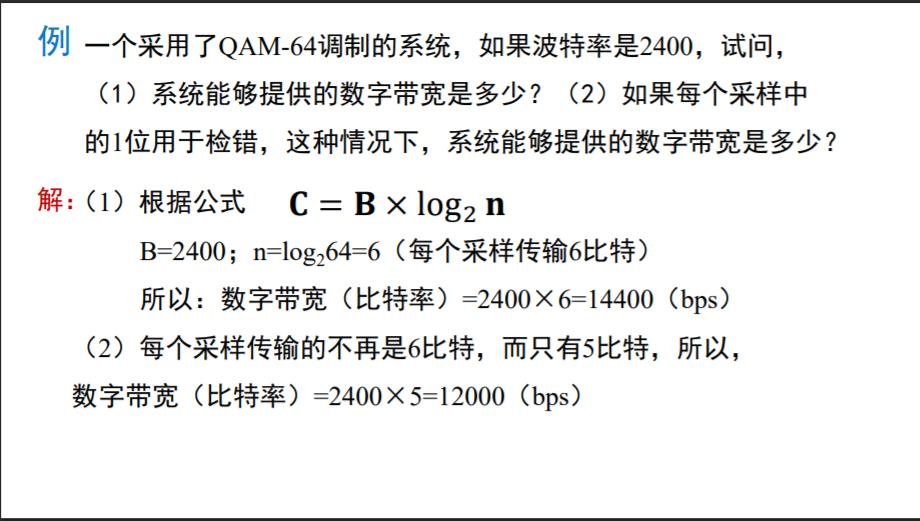

# 第二章：物理层

## 物理层概述

物理层是参考模型中最基础的一层，它没有下一层的支撑，它为 数据链路层服务。

主要功能：提供透明的比特流传输

- 封装好的数据以“0、1”比特流的形式进行传递，从一个地方搬到另一个地方
- 物理层上的传输，从不关心比特流里面携带的信息，只关心比特流的正确搬运

### 物理层的四大特性

机械特性：指明接口所有接线器的形状、尺寸、引脚数和排列等，如 RJ45

电气特性 ：指明在接口电缆的各条线上出现的电压的范围

功能特性 ：指明某条线上出现的某一电平的电压表示何种意义

规程特性 ：指明对于不同功能的各种可能事件的出现顺序；规程的概念类似协议

### 物理层上数据的传输：信号

信号：数据的电器或电磁表现

模拟信号：对应时域的信号取值是连续的

数字信号：对应时域的信号取值是离散的（代表不同离散值的基本波 形称为码元）

信号在传输的过程中，可以看成由很多不同频率的分量的传输，因为高频分量的不等量衰减，接收方收到的信号是衰减和变形(失真)的。

 一般来说，从0~fc这一段频段，振幅在传输过程不会明显衰减，fc称为截止频率。（单位：赫兹）

物理带宽：传输过程中振幅不会明显衰减的频率范围 （一种物理特性，通常取决于介质材料的构成、厚度、长度等）

数字带宽：单位时间内流经的信息总量

信号在传输的过程中，会发生衰减和变形，所以，数字带宽是有上限的

### 数字带宽与物理带宽的关系

理想无噪声信道：乃奎斯特定理（提高传输速率：提高物理带宽和离散等级。物理带宽是物理特性不能随意增加，只有增加离散等级）

有噪声信道：香农定理（在信道一定的时候，物理带宽确定，要想提高最大传输速率（数字带宽）只有增加信噪比）

## 物理层设备

### 物理层部件 / 设备有哪些

被动部件 / 设备：接线板、插头、插座、电缆

主动部件 / 设备：转发器、中继器、集线器

收发器（Transceiver）也叫Media Attachment Unit（MAU）：将一种形式的信号转变成另一种形式

中继器 （Reapte）：再生信号，让线缆可以延伸得更远，增加连接到网络点的结点数，不能过滤流量（过滤是指设备以一定的特征（如源地址、目的 地址、网络协议等）来屏蔽网络流量，并根据已有的标准确 定将流量转发或丢弃。）

集线器（Hub）：多端口的中继器，放大和再生信号，允许很多设备连接到一个集线器上，作为星型拓扑的中心，不能过滤交通流量

冲突：即信号碰撞， 当使用物理层设备时，更多的用户争抢共享资源，导致冲突

冲突域：数据包产生和冲突的网络区域，即指共享媒质区

### 总结

物理层（第一层）的设备都是傻瓜设备，不具备过滤流量等智能

物理层设备的使用，增大了冲突域，降低了网络的性能

组网中，很少再使用中继器和集线器了

## 引导性传输介质

引导性传输介质：也叫有线传输介质，铜线（同轴电缆，双绞线），光纤

非引导性传输介质（无线传输介质）：无线电、卫星、激光

同轴电缆：由中心导体、绝缘材料层、网 状导体、外部绝缘料4层组成
基带同轴电缆：用于数字传输（屏蔽层为铜）
宽带同轴电缆：用于模拟传输（屏蔽层为铝）

双绞线：由两根具有绝缘层的铜导线按一定密度，逆时针方向绞合而成，消除：近端串扰。一般地，绞距越紧（小），则抵销效果越好，传输性能越好

**非屏蔽双绞线**（**UTP**：Unshielded Twisted Pair）：优点：成本低，尺寸小，易于安装；缺点：易受干扰，传输距离性能差，受绞距影响

屏蔽双绞线（STP：Shielded Twisted Pair）：优点：抗EMI/RFI干扰；缺点：成本高，安装不易

网屏式双绞线（ScTP：Screened Twisted Pair）：折中

电力线：家居中，电源线无处不在；方便而恐怖

光纤（光导纤维的简称）：由极细的玻璃纤维构成，把光封 闭在其中并沿轴向进行传播；优点：重量轻、损耗低、不受电 磁辐射干扰、传输频带宽、通信 容量大；缺点：昂贵，易断裂

光纤原理：当入射角>临界角时，光的全反射

光传输系统组成：光源、传输介质和探测器

单模：以单一模式传输，激光产生的单束光，纤心细、高带宽、 长距离，运行波长为850nm或1300nm

多模：以多个模式同时传输，LED产生的多束光，纤心粗、低带 宽、短距离，运行波长为1310nm或1550nm 

光纤断了连接：光纤连接器（光损失10%~20%）；机械拼接，特殊的套管夹紧（光损失10%）；熔合（几乎无损失）

**光纤相对铜线的特性：带宽高，距离远，损耗低；重量轻；无电磁干扰和射频干扰（EMI和RFI），防窃听；端口设备价格高**

**怎样选择传输介质：传输速率，成本要求，周围环境，介质间的互操作性、相容性，最优的性价比**

## 复用技术

复用技术是让多用户共享同一根信道（干线）

### 频分多路复用FDM（重点）

Frequency Division Multiplexing 将频谱分成若干段，每个用户占据一段来传输自己的信号。

#### 		正交FDM，OFDM

Orthogonal FDM，OFDM是用于802.11、4G蜂窝的高效FDM技术和其他通讯

#### 		波分多路复用WDM（重点）

WDM (Wavelength Division Multiplexing)，本质跟 FDM一样，在**光纤上复用信号**

### 时分多路复用TDM（重点）

Time Division Multiplexing，在时间上共享信道，用户轮流使用信道，广泛用于 telephone / cellular系统

#### 		统计时分多路复用技术STDM

Statistic TDM；动态分配信道，不使用信道的用户不分配，分给有需要的用户使用；利用率可提高2~4倍；实现技术较复杂，通常只在高速远程通信中使用，如ATM；用户平均使用信道的情况不适用

### 扩展频谱技术CDMA（重点）

每个用户拥有一个唯一码片序列，码片是正交的，能够同时传输，广泛用于3G网通信

## 调制技术

### 调制机制使用信号来传输比特

Baseband Transmission（基带传输）：信号的传输占据传输介质从零到最大值之间的全部频率

Passband Transmission（通带传输） ：通过调节信号的振幅、 相位或频率来传输比特 （特点：信号占据了以载波信号频率为中心的一段频带）

### 基带传输

直接将数据比特转化为信号，

Line codes（线路编码）：发送 symbols（样本、符号），一 个样本可传送1个或多个比特

不归零NRZ：高电平表示1，低电平表示0；随着时间漂移的累计，接收方无法辨别几个1和几个0（没有电压跳变）

不归零逆转NRZI：在比特时间中间做电压的跳变来表示1，无跳变则表示0；连续1的问题得到解决，但无法解决连续0的问题，在USB使用

曼彻斯特编码：在比特时间中间，电压从高变到低表示1，反之从低变到高表示0；编码效率只有50%

双极编码（交替标记逆转AMI）：两级电压的交替出现表示1，不出现则表示0，实现了信号的平衡

4B / 5B ：4比特数据被映射为1个5比特模式；抛开连续0的组合，解决连续0的问题，相比曼彻斯特编码提升了80%效率

### 通带传输

在一个信道上，发送消息所使用的频率范围并不是从0开始的，在某个频段上，通过调节信号的**振幅、相位或频率**来传输比特

基本调制方法：调幅，调频，调相，工程应用中是综合使用，用星号星座图来表示调制的级别

### 格子架编码调制（TCM）

为了追求高的数字带宽，总是想办法提高信号级别，即星号星座上的星点密密分布，这导致出错率的上升。 

**为了降低高速调制错误，在每个样本中采用一些额外的位用作纠错，剩下的位才用来传输数据**，这种机制叫格子架编码调制TCM (Trellis Coded Modulation)。 

在 V.32调制标准中，波特率是2400，采用了QAM-32，每码元传输5个比特，但其中的1个比特用来做奇偶校验，所以，数据传输率只有9600bps

## 公共交换电路网络

### 公共交换电话网络（PSTN： Public Switched Telephone Network）

任务：传递人类的语音

计算机网络的任务：传输数据

公共交换电话网络的主要构成及技术 

- 本地回路：调制技术（The Local Loop: Modems）
- 干线及复用技术（Trunks and Multiplexing）
- 交换

### PSTN的历史变迁

全联通网 --> 中心交换网 --> 层次交换网

人工交换 --> 全自动交换

### PSTN的结构：从一个典型电话路径来看

**由本地回路、干线和交换局三个部分组成**

**呼叫方的话音** -- 本地回路 （模拟线路，进入千家万户和业务部门）--> **端局**（不是PSTN的主要构成） -- 干线 （数字光纤，连接交换局）--> **上级交换局**（话音接驳干线的场所） -- --> **对方的端局** -- --> **被叫方**

### 本地回路

调制解调器（Modem，猫）：用于将计算机产生的数字比特流转变为载波输出（模拟信号）

56k的调制解调器：

- 采用V.90标准
- 电话线路的频率约是 4000 Hz (300 ~ 3400 Hz)
-  采样率 = 2 x 4000 = 8000 sample/sec
- 每个码元传输 8比特，其中的1比特用来控制错误，传输数 据速率是 8000 x 7 = 56,000 bit/sec（56 kbps）

数字用户线（xDSL）：

- 连接调制解调器的本地回路所使用的带宽被限制在了 300~3100hz（4k）
- xDSL使用了本地回路的全部物理带宽，大约为1.1Mhz，而不 仅仅是4khz
- 1.1M/4k≈256，第1根4k信道仍用语语音，接下来的5根信道空闲，剩下的250根信道用于数据和控制

### 光纤到户(Fiber To The Home) 

FTTH 宽带：

- 很多用户共享同一波长
- 光纤是无源的 (无须放大器，可靠)
- 光进铜退

干线：多路复用

干线 --> 光纤 --> 连接交换局（包括端局）的连接 -- 编解码器（codec）（将模拟信号数字化或者数字信号模拟化）--> 脉冲编码调制**PCM**（Pulse Code Modulation）将模拟信号数字化技术，**构成了现代PSTN的核心**

PSTN的核心是脉冲调制PCM，T系列是用于北美和日本的一个时分复用系统，用线路T1由24路话音公用， 每125微妙传送一个 复用帧。

### PSTN交换

电路交换（Circuit switching ）：在数据传输前，必须建立一条端到端的通路，称为连接。其中可能穿越多个交换局，每个交换局都必须提供连接，数据沿通道按顺序送达，数据完成拆除连接

报文交换（Message switching ）：无论数据传输过程要跨越多少个交换局，只要下一站空闲，该数据即送至下一站。无需提前建立连接。 
实例：电报，存储转发网络 
问题：中转站的存储要求高

分组交换（Packet switching）： 限制分组大小。允许分组存储在交 换局的内存里；每个包携带目的地址、信息（独立寻径）；乱序送达

比较：

包交换是按需分配的，电路交换是提前分配的

分组交换容错能力更强，因为可以独立寻径

包交换是乱序到达；电路交换是先发先到，接收方无需排序

包交换是按流量计费，电路交换是按时间计费

