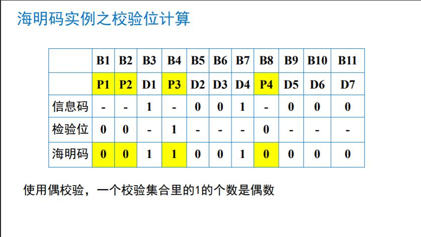
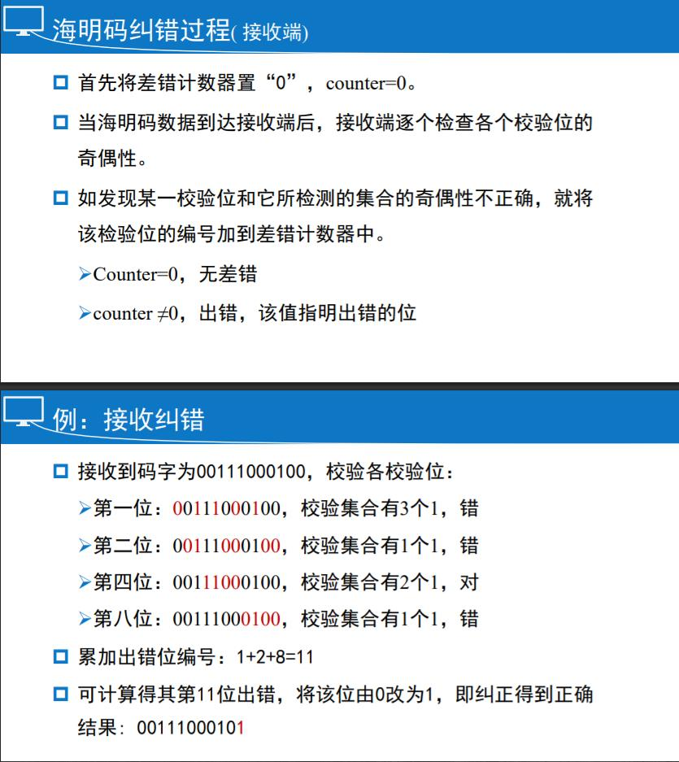

# 第三章：数据链路层

## 数据链路层概述

为网络层提供服务，良好的服务接口。

作用：保证数据传输的有效、可靠

- 差错检测和控制
- 流量控制（基于速率，基于反馈）

位于网络层之下，物理层之上。

数据链路层使用物理层提供的服务，物理层处理的是位流， 数据链路层处理的是帧（数据链路层的PDU）

### 成帧

将原始的位流分散到离散的帧中，叫成帧，成帧的方法有：

- 字符计数法
- 字节填充的标记字节法
- 比特填充的标记比特法
- 物理层编码违例法

### 字符计数法

在帧的头部第一个数字为该帧的长度

特点：

- 简单
- 一旦出错，无法恢复，即无法再同步
- 很少被使用

### 字节填充的标志字节法

该方法考虑了错误之后重新同步的问题，让每一帧都 用一些特殊的字节作为开始和结束
标志/标记 字节（flag byte）

特点：

- 容易造成帧界混淆 -- 增加转义字节
- 任意比特数的帧不适用，须是8位字符整数倍

解决方法：

- 在二进制数中偶然出现的标志字节前插入一个转 义字节。这就称为字节/字符填充法
- 改进：位填充

#### 比特填充的标志比特法

这是一种面向二进制位的帧格式，把所有需传输的数据以比 特位一字排开，并以特殊的位模式01111110作为帧标志，即 一个帧的开始（同时标志前一个帧的结束）

当帧内容中出现一个与帧标志相同的位串01111110，则在5个 1后插入一个0，即变成01111101，接收方将自动删除第5 个1 后的0。这称为**位填充法（零比特填充法）**，也称为透明传输。

如果由于干扰，一个帧没有正确接收，则可扫描接收串，一 旦扫描到01111110，即新的一帧从此开始。即可以再同步

优点：

- 传输任意比特数的帧
- 传输效率更高

### 物理层编码违例法

在曼切斯特编码中，连续高电平或连续低电平可用作帧边界

采用冗余编码技术，如曼切斯特编码，即两个脉冲宽来表示 一个二进制位

## 差错处理概述

不存在完美信道，传输总会出错

首先要检查出错误

处理错误的手段：

- 纠错：恢复出正确的来
- 检错：仅仅检出错误，不恢复，通常伴随重传

错误类型：

-  单个错误：分散在各块中
- 突发错误：集中在某个块中，整个块都是错误

突发错误比单个错误更加难于处理 ，通常利用处理单个处理的方法来应对突发错误

### 差错的处理

纠错码 ——前向纠错技术：发现错误，从错误中恢复出正确 的来。因其需要太多的冗余位，纠错开销太大，在有线网络中极少 使用，主要用于无线网络中，因为无线网络本身存在误码率大的缺陷

检错码：只能发现错误，不能从错误中恢复，但可采用重传。计算机网络中主要采用循环冗余码(CRC)

### 海明距离（ Hamming Distance ）

码字：包含数据位和校验位的n位单元

海明距离：两个码字(codeword)的海明距离 : 两个码字之间不同位的数目。如：10001001 和10110001 的海明距离为3，即异或的结果中，1的个数为海明距离

全部码字的海明距离：全部码字中任意两个码字之间海明距离的最小值

海明距离的意义在于：如果海明距离为d，则一个码字需要发 生d个1位错误才能变成另外一个码字

检错：**海明距离为d+1的编码能检测出d位差错**

纠错：**海明距离为2d+1的编码，能纠正d位差错**

- 随着海明距离的增加，纠错的能力也增加；即海明距离越大，纠错能力越强
- 海明距离为3，可以纠正1个错误；而海明距离为5，才可以纠正2个错误
- 当一个系统中的海明距离增加的时候，合法码字就减少了； 即传输效率降低

## 纠1位错的海明码

的数据是 m 位，冗余位 r

凡编号为2的乘幂的位是校验位，如1、2、 4、8、16、……

其余是数据位，如3、5、6、7、9、……

发送方：根据校验集合填充校验位

接收方：根据校验集合判定校验位是否出错，出错的位编号累加到累加器上，所有的校验位都检查完成后，通过读取累加器的值来确定码字中出错的那一位的编号

### 利用海明码纠正突发错误

将连续的k个码字按行排列成矩阵

发送数据时，按列发送，每列k位

如果一个突发性错误长度是k位，则在k个码字中，至多只有 一位受到影响，正好可用海明码纠错改位后恢复

## 检错码

为什么要用检错码？

纠错需要较多的冗余位，信道利用率不高

局域网中，主要使用的是检错码

- 奇偶校验码（海明距离为2，检1位错）
- 互联网校验和
- 循环冗余校验码

### 奇偶校验码

### 互联网校验和

校验和：进行模 2 加运算

检验位：追加到报文尾部

常见：16位互联网校验和

### 循环冗余检错码CRC

.jpg)

.jpg)

.jpg)

.jpg)

.jpg)

若还有余数，则检验出错

### 练习

### 总结

## 基本数据链路协议 -- 三个单工协议

数据的传输在某时是单向的

### 无限制的单工协议（协议1）

- 数据单向传送
- 收发双方的网络层都处于就绪状态（随时待命）
- 处理时间忽略不计（瞬间完成）
- 可用的缓存空间无穷大（无限空间）
- 假设DLL之间的信道永远不会损坏或者丢失帧（完美通道）
- “乌托邦”（不可能实现的）

### 单工停—等协议（协议2）

- 解决如何避免收方被涌入的数据淹没，即取消“接收方允许 无限量接收”的假设
- 解决方法：收方回发一个哑帧，接收方收到哑帧，表明收方 允许接收数据，此时再次发送下一帧数据。
- 实际上是半双工协议

### 有噪声信道的单工协议（协议3）

有噪声就会产生差错，有差错就可能会引起以下这些问题： 

接收方检测到错误帧，如何通知发送方？如何恢复正确帧？

- 对正确帧的确认
- 定时器超期：重传
- 重传定时器可防止死锁的产生

有噪声就会产生差错，有差错就可能会引起以下这些问题：

数据帧或确认帧在途中丢失将如何解决？

- 定时器超期：重传

有噪声就会产生差错，有差错就可能会引起以下这些问题：

有可能收到重复帧，如何解决？

- 给每个帧一个独一无二的序列号
- 序号也用来重组排序

#### 主动确认重传

- 接收方无误，回发确认帧。
- ARQ:automatic repeat request
- PAR:positive acknowl-edgement with retransmission

#### PAR/ARQ的基本工作机制

发送方每发出一个帧，启动一个重传定时器

超时前，如果收到收方的确认，拆除定时器

超时还未收到确认，重传，重置定时器

- 数据帧丢失或错误
- 确认帧丢失

### 提高传输效率

- 全双工
- 捎带确认
- 批量发送数据（管道化技术、滑窗技术，协议4 ~ 6）

### 总结

协议1处理的是“完美”的传输环境，所以 叫“乌托邦”协议。

协议2做了简单的流控，防止接收方被数据 所淹没。

协议3解决了噪声信道带来的错误，引出了 肯定确认技术。

三个协议都是模拟协议，关注其中的技术。

## 滑动窗口协议

两个窗口

发送窗口：对应着 已经发送但还未被确认的帧 的序号

接收窗口：对应着 期望接收 的帧的序号

### 窗口滑动条件

接收方收到帧后，首先核对是否为预期帧号(frame_expected)， 如果是的，则接收并frame_expected+1，即移动接收窗口.

发送端收到应答帧，核对响应帧号next_frame_to_send，核对 无误后，从网络层取新的帧，并执行next_frame_to_send+1， 即移动发送窗口。如核对帧号不正确，则不移动窗口

### 滑动窗口的基本概念

### 协议4的滑动窗口基本工作原理

