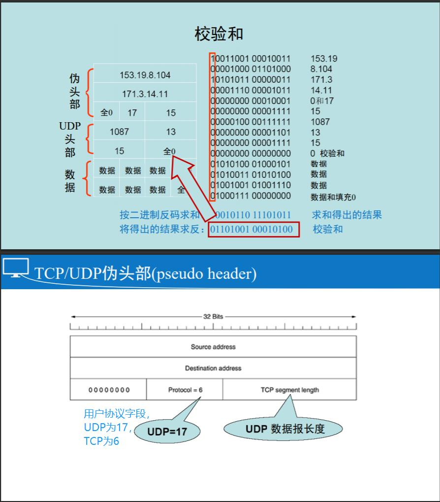
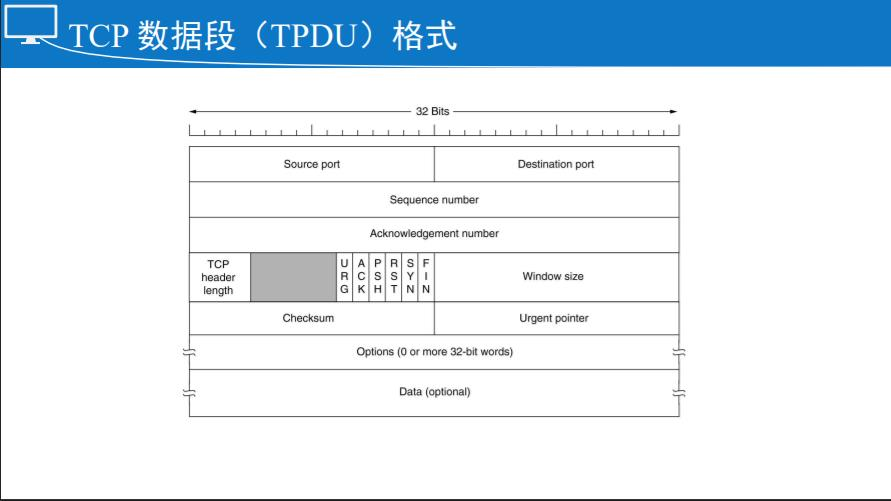
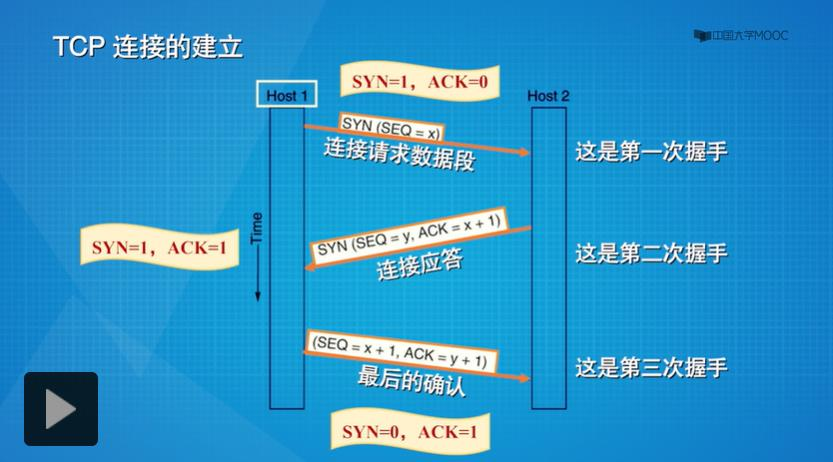
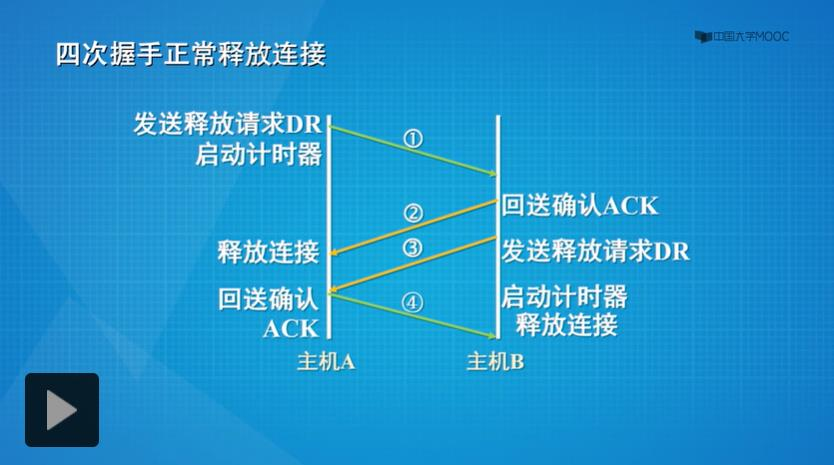
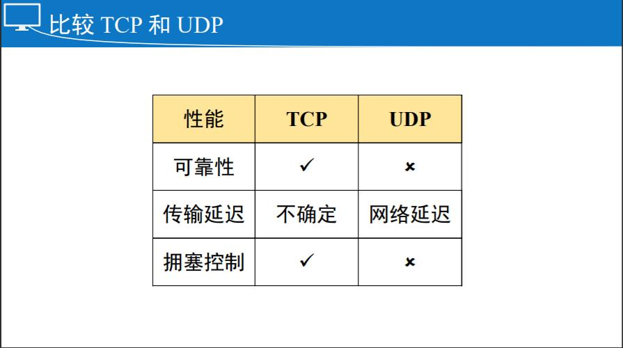

# 第六章：传输层

## 传输层概述

传输层是整个协议栈（TCP/IP）的核心

**任务是提供可靠的，高效的的网络传输**

传输实体：完成传输层任务的硬件或软件

- 传输实体可以在操作系统的内核
- 可以以一个链接库的形式绑定到网络应用中
- 可以以一个独立的用户进程运行
- 甚至可以实现在网络接口卡（网卡）上
- 传输层利用网络层的服务，为它的上层应用层提供服务
- 与网络层提供的服务相似：面向连接的服务和无连接的服务

为什么需要两个独立的不同的层？

- 网络层运行在由承运商操作的路由器上，因此用户无法真正控制到网络层
- 把另一层放在网络层之上，可以让用户能够控制到服务质量
- 传输层原语独立于网络层原语，而网络层原语会因为网络的不同 而不同

### 传输层服务和网络层服务显著不同点（作用范围不同）

- 网络层负责把数据从源机送达到目的机（Host to Host 主机到主机）
- 传输层负责把数据送达到具体的应用进程（End to End 端到端）（端也就是端点 end point，端点也就是套接字 socket，与具体应用进程绑定在一起）

**传输层的主要服务：由传输层的端口号定位到正确的具体的应用进程**

### 数据段（TPDU，传输层协议数据单元）

TPDU (Transport Protocol Data Unit) 是从传输实体发到对端传输实体的信息，有的教材也称为（segment）

TPDUs 作为数据（载荷）被封装在分组（packet）中，由网络层传输交换

分组作为数据（载荷）被封装在帧（frames）中，由数据链路层传输交换

### 传输层主要两个常用协议

用户数据报协议：UDP（User Datagram Protocol）

传输控制协议：TCP（Transport Control Protocol）

## 用户数据报协议（UDP）

**UDP（User Datagram Protocol）是一个无连接的（connectionless）的传输层协议**

 **UDP 传输数据段，无须建立连接，不提供可靠传输**

很多C/S应用(如： DNS)，都使用UDP发送一个请求， 然后对方应答

### 为什么需要使用UDP

**最主要的是可以使用源端口和目的端口，而IP不可以**

### UDP 数据段头

UDP 数据段包括4个字段共**8字节（ 8-Byte）即 64Bits 的头部**和数据两个部分

 其中第3个字段，长度字段（长度域）表示的长度包括头部和数据总共有多少字节

第4个字段是校验和（checksum）是可选的，如果不计算校验和，则该域置为 0

UDP 数据段中最独特、最重要的字段是第1、2个字段，分别表示源端口和目的端口，都是用16 Bits 来表示

### 端口（port）定义

16位表示的端口的数量是：2^16=65536

端口范围是：0~65535

- 小于等于1023（知名端口）：用于公共应用（保留，全局分配， 用于标准服务器，只能用于特权用户，比如 Unix 的 ROOT 用户启动的标准80服务），由IANA分配
- 1024~49151：用户端口，注册端口（非特权用户端口，可通过IANA注册，比如BT使用了6881-6887的端口）
- 大于等于49152：动态端口，私人端口

#### 自由端口(Free port)

- 本地分配
- 动态地随机端口
- 例如访问一个网站的时候，对方的端口号通常是一些知名的端口，比如说80，而自己这边的端口是自由端口，通常是由操作系统随机分配的一个大于49151的端口号

### UDP 第4个字段校验和

如果收方的校验和为全1，则传输无错

检错能力较弱，但简单快速

使用IP地址，破坏了分层原则

### 总结

UDP是传输层的一个轻量级协议，提供断点表示，高效的端到端的数据段传输

不提供差错检测和可靠传输，但简洁高效

 UDP数据段包括头部和载荷两部分，头部有8个字节（32Bits），共4个字段（源端口地址，目的端口地址，长度字段，校验和）

## 通信模型

不管是UDP还是TCP，数据段都是从一个端点传输到另一个端点，即端到端，而端点也就是套接字socket

一个套接字包括两个元素，IP地址和端口号，可以写成（IP，Port）

### 通信5元组

源端：

Source IP：源IP

Source Port：源Port，端口号是用16位表示的

传输协议：TCP，UDP

目的端：

Destination IP：目的IP

Destination Port：目的Port

### 通信3元组

源端点、协议、目的端点

### 总结

传输层PDU(数据段）不仅仅送达主机，而且送达端点，即应用进程

通信5元组：目的IP地址，目的端口，传输协议，源IP地址，源IP端口

UDP和TCP的通信模型相同吗？

相同。都是传输层协议，都为用户提供服务不同点；TCP是可靠的，面向链接的，UDP是不可靠的，无链接的

## TCP 数据段

TCP (Transmission Control Protocol) 是专门为了在不可靠的互联网络上**提供可靠的端到端字节流**而设计的

TCP必须动态地适应不同的拓扑、带宽、延迟、分组大小和其 它的参数，并且当有错误的时候，能够足够健壮

### 传输控制协议

支持TCP的机器都有一个 TCP 实体，或者是**用户进程或者是操作系统内核**，都可以管理TCP流和跟IP层的接口

发方：封装

TCP实体接收本地进程的用户数据流，将其分割成不超 过64kB的分片（实践中，通常分割成1460字节，以通过 以太网传输）

收方：解封装

当包含 TCP 数据段的报文到达某台机器的时候，被提交给传输实体，传输实体将其重构出原始的字节流

### TCP 协议

TCP连接上的每个字节都有它自己独有的32位序列号

收发双方的TCP实体以数据段的形式交换数据

一个数据段包括**20字节的头部**（不包括可选项）和数据域（0 或更多字节）

**TCP数据段的长度需要考虑：**

- IP分组网络载荷限制
- 下层网络的MTU

### TCP数据段（TPDU）格式

20 个字节的头部（不包括可选项）+ 变长的数据字段 / 域（可以是 0 个或更多字节）+ 不含选项的头部有 14 个字段 / 域

第 1、2 个字段表明了一个两节自的两个端点：源端口 和 目的端口

- 通信五元组中的两个重要元素
- 用来跟踪同一个时间内通过网络的不同会话，一般每个端口对应一个应用进程

第 3 个字段：序列号

- 表示一个字节的编码
- 初始序列号 ISNs (initial sequence numbers )：随机产生的

第 4 个字段：确认号

- 期望接收的字节编码（32位）
- TCP 的可靠传输保证，采用了肯定确认机制，例如：确认号500，发送到收方499/498……序列号的字节，下次可以发送序列号为500的字节数据过来，使用了累计确认技术

第 5 个字段：4 Bits 表示的 TCP 段头长度，单位32位（4字节）

保留字段：也在逐步启用，例如：用来做拥塞控制等

第 6 ~ 11 字段都是 1 Bit 的字段，也称为控制字段

第 6 个字段：URG（表明紧急指针是否使用）

- 当紧急指针使用的时候，URG 被置为1。紧急指针（Urgent pointer）是一个对于当前序列号的字节偏移量，标明紧急数据从哪里开始
- 即使win=0（是告诉对方不可以发送数据），也可以发送这样的紧急数据段。比如，用户发出 ctrl + c 中断命令，就可以以紧急数据的形式发送出去
- 当URG=1时，表明有紧急数据，必须首先处理；收方收到这样的数据后，马上处理，处理完后恢复正常操作

第 7 个字段：ACK（表明确认号是否有效）

- 设为 1 表示确认号有效
- 设为 0 表示确认号无效

第 8 个字段：PSH（表明数据是否需要缓存）

- 表示这是带有 PUSH 标志的数据，接收方收到这样的数据，应该立刻送到上层而不需要缓存它

第 9 个字段：RST（重置连接或者再连接建立阶段拒绝连接）

- 用来重置一个混乱的连接，如果在连接建立阶段，就直接拒绝建立连接

第 10 个字段：SYN（表明连接建立过程，通常与 ACK 一起）

- 用在连接建立过程
- 通常与 ACK 一起，指示连接建立的某一个环节，如 SYN = 1，ACK = 0，表明是一个连接请求；SYN = 1，ACK = 1 表示一个连接接受的信息

第 11 个字段：FIN

- 用来释放连接，表示发送方已经没有数据要传输，但是可以接收数据

为了避免收方被大量涌入的数据所淹没，TCP 实体进行了流控（Flow control），通过可变长的滑动窗口来实现流控

第 12 个字段：Window size（窗口尺寸 16 位）

- 告诉对方可以发送的数据字节数，即从确认字节号开始，连续发送的字节总数
- 窗口尺寸的大小取决于接收方

第 13 个字段：Checksum 校验和（提供额外的可靠性）

- 计算方法跟 UDP 数据段中校验和计算一样，唯一不一样的就是为头部中的用户协议值取为 6
- 校验的范围包括头部、数据和概念性的伪头部

第 14 个字段：Urgent pointer 紧急指针

- 与 URG 控制位配合使用，指明了紧急数据

如果有选项域

- 它提供了一种增加基本头没有包含的内容的方法

### 总结

TCP 是一个复杂的传输层协议，负责将 TCP 数据段可靠地送达目的端

相比 UDP 段头，TCP 段头非常复杂，包含了 14 个字段

- 源端口，目的端口（通信五元组中的两个）
- 序列号：为每个字节编号
- 确认号：ACK 控制位置位才有效
- 六个控制位：用于连接建立、拆除、异常处理等
- 窗口尺寸：用于流控，以免收方被数据淹没

## TCP 三次握手建立连接

TCP 是提供面向连接的服务，TCP 数据段传输是在 TCP 连接上进行的，TCP 连接时三次握手建立的

### TCP 连接的建立

- 一方（server）被动地等待一个进来的连接请求
- 另一方（the client）通过发送连接请求，设置一些参数
- 服务器方回发确认应答
- 应答到达请求方，请求方最后确认，连接建立

Host1 首先发送一个连接请求数据段，这个特殊的数据段叫 SYN，包含了一个初始序列号 x，它是一个随机产生的，控制位 SYN = 1，ACK = 0，整个 SYN 叫做第一次握手信息

Host2 收到了 Host1 的 SYN，会回发一个连接应答，也叫 SYN，里面包含了一个初始序列号 y，这个初始序列号是 Host2 随机产生的，控制位 SYN =1，ACK = 1，同时它的确认号叫 ACK number 等于 x + 1，表示对 Host1 的 x 号字节的确认，这是第二次握手信息

当连接应答到达 Host1，Host1 发送最后的确认，包含序列号等于 x + 1，确认号 y + 1，控制位 SYN = 0，ACK = 1，这是第三次握手信息

当第三次握手信息到达对方的时候，这个连接就建立起来了

任何采用了 TCP 的应用，都会在正式传输数据之前搭建这根 TCP 连接

三次握手建立 TCP 连接也被称为同步，这个过程中交换的最重要参数是初始序列号，这个可以跟踪后续交换的每一个字节，也就是后续字节的编号就是以这个初始序列号作为基础的

建立 TCP 连接的双方没有主从之分，它们可以相互收发数据，所以 TCP 数据段的传输是全双工的

### 安全问题

SYN 泛洪导致 DoS 攻击

攻击者先控制一些机器，在机器上面安装 agent，agent 向被攻击的服务器不断地（泛洪）发送第一次握手信息 SYN，在 SYN 里使用了一个伪造的源 IP 地址，带有伪造源 IP 地址的第一次握手信息到达被攻击服务器，就会回发第二次握手信息并且等待第三次握手信息，因为第二次握手信息无法到达发送者，所以第三次握手信息一直等不来，这会使被攻击者挂起很多的进程进行等待，最终因为资源耗尽瘫痪，无法提供正常服务，这就是 DoS 攻击

数据传输开始后可能有两个原因导致阻塞

- 快的机器向慢的机器发送数据
- 多台机器同时向一台机器发送数据

### 总结

TCP 数据段传送之前，一定要建立 TCP 连接

通过三次握手建立 TCP 连接

1. SYN = 1，ACK = 0
2. SYN = 1，ACK = 1
3. SYN = 0，ACK = 1

三次握手建立连接是一个同步的过程，交换初始序列号，保证后续每一个字节的可靠传输

## TCP 连接释放

- 任何一方在没有数据要传送的时候，都可以发送一个 FIN 置位了 的 TCP 数据段
- 当 FIN 被确认的时候，该方向的连接被关闭
- 当双向连接都关闭了的时候，连接释放

TCP 连接释放是对称的，TCP 连接向两个单向链接要求两端的连接释放请求，都被确认

我们把释放连接的决定权交给请求者独立裁定，而不是由对方裁定

- 比如，一方发送连接释放请求 DR（Disconnect Request），且期待对方的确认 ACK
- 当 DR 到达接收端，它回发 ACK，并且也发送一个 DR
- ACK 到达发送端的时候，连接释放；同时，它回发确认 ACK，当这个 ACK 到达接收端，反方向的连接也释放了

### 定时器

为了避免两军对垒问题，或者为了避免 DR 和 ACK 丢失而引发的问题，采用定时器（两军对垒：最后一方不敢确信对方是否收到信息）

任何时候，发出 DR 的同时，都启动一个定时器

- 如果一方发送了 FIN 置位了的 DR 数据段出去，却在定时器超期之时都没有收到应答，释放连接
- 另一方最终会注意到连接的对方已经不在了，超时后连接释放

理论上讲，如果初始 DR 的和重传都丢了，协议失败

- 发送者将因超时放弃发送且释放连接，但是，另一端却不知道这些，仍然处于活跃状态
- 这种情形导致半开放连接（half-open）

杀死半开放连接的方式：

- 如果在一定的时间内，没有 TPDUs 到达的话，连接自动释放
- 如果是这样，传输实体在发送一个 TPDU 的时候必须启动定时器，定时器超期，将发动一个哑 TPDU（dummy TPDU），以免被断掉

### 四次挥手

第一次握手信息时 A 发现自己没有更多的数据要传送了，所以这时候发送连接释放请求 DR，在发出 DR 的同时启动一个定时器，这次的 DR 就是第一次握手信息

当这个 DR 到达B的时候，B 会回发一个确认 ACK，当这个 ACK 到达 A 的时候，这方向的连接（图线2）就释放了

同时刚才收到 DR 的一方 B 也会发出一个链接释放请求 DR，当这个 DR 到达 A 的时候，A 会再回发一个 ACK，ACK 到达 B，那么这个方向的连接（图线4）也释放了

双方在发送 DR 的同时都启动了一个定时器，当定时器超期之时，强制释放连接 

### 总结

TCP 是全双工的，连接的释放也必须是双向的，FIN = 1

半开放连接必须杀掉

定时器的作用很重要，超时将释放连接

## TCP 传输策略

TCP传输的是全双工的字节流

TCP适配收发双方的数据流量 -- Windows size，窗口尺寸受制于接收方

当窗口数为0时，发送者不能正常发送数据段，除非：

- Urgent数据。比如，用户想杀掉远端机器上的进程的时候， 可以发送数据
- 发送者可以发送一个字节的数据段，以便让接收者再次发送 期待接收的字节号（确认）和窗口数（避免死锁）

傻瓜窗口综合征 （窗口一空闲就告知发送方窗口变更信息）-- Clark 解决方案

接收端可以推迟500ms发送确认分组和窗口更新窗口，以便 可以免费搭载在处理后的回显分组内（free ride）

发送方：Nagle

- 尽量不发送数据含 量小的数据段
- 缓存应用层的数据， 达到一定量再发送数据段
- 有时候最好禁用，如远程移动鼠标操作

接收方：Clark

- 不请求对方发送短数 据段(window size)
- 延迟窗口变更信息，使接收缓冲区足够大

## TCP 拥塞控制

虽然网络层有拥塞控制，但是大多数控制还是由 TCP 来完成的，解决方案 -- 减慢数据率，所以TCP 拥塞控制遵循分组守恒定律，即当有一个老的分组离开之后，才允许新的分组注入网络，TCP 希望通过动态维护一个窗口大小来实现这个目标

慢启动，拥塞避免，快重传，快恢复

### 拥塞检测（Congestion detection）

所有的互联网TCP算法都假定超时是由拥塞引起的，并且通过监视超时的情况来判断是否出现问题

### 拥塞控制（Congestion prevention）

#### 拥塞的问题

- 网络容量（当一个连接建立的时候，双方选择一个合适的窗口大小，接收方根据自己的缓冲区大小来指定窗口的大小）
- 接收者容量（如果发送者遵守此窗口大小的限制，则接收端不会出现缓冲区溢出的问题，但可能由于网络内部的拥塞而发生问题）

为此，每个发送者维护两个窗口：

- 接收者窗口 大小反映了目前窗口的容量 （容易控制）通过接受者的缓存来确定大小
- 拥塞窗口 大小反映了网络目前的容量（难于控制）
- ！！发送者发送的数据字节数是两个窗口中小的那个窗口数！！

#### 确定拥塞窗口的大小CWMD -- 慢启动算法（尝试的过程）

- 当连接建立的时候，发送者用当前使用的最大数据段长度初始化 拥塞窗口，然后发送一个最大的数据段
- 如果在定时器超期之前收到确认，则将拥塞窗口翻倍，然后发送 两个数据段……直至超时（或达到接收方窗口的大小）
- 确定出拥塞窗口的大小。如：如果试图发送 4096 字节没有问题，但是发送8192字节的时候， 超时没有收到应答，则拥塞窗口设为4096个字节
- 注意：每成功发送一次数据段，拥塞窗口值翻倍，其实一点都不慢，即拥塞窗口值按指数增长直至超时，定义拥塞窗口大小cwnd

#### 通过阈值调节 CWMD 尝试的粒度

- 除了使用接收者窗口和拥塞窗口，TCP拥塞控制还是用了第三个参数，阈值（threshold），初始化为64K
- 当一个超时发生的时候，阈值降为当前拥塞窗口的一半，同 时将拥塞窗口设为一个最大数据段的长度
- 使用慢启动算法来决定网络的容量，拥塞窗口增长到阈值时 停止指数增长
- 从这个点开始，每次成功的传输都会让拥塞窗口线性增长 （即每次仅增长一个最大的数据段长度）

注意

- 线性增长，可以将越来越粗放的窗口尝试粒度变小，以获得更准确的拥塞窗口值
- TCP 慢启动算法就是这样不断超时、不断重启，尝试出的拥塞窗口值也随着网络状况的变化而变化，达到拥塞控制的目的
- ！！快速恢复：重新启动的时候，拥塞窗口值不用重置为一个数据段大小，而是可以设置为阈值大小，从这里直接开始线性增长
- 任何时候，如果收到一个ICMP抑制分组（ ICMP source quench）并被送 给TCP传输实体 ，则这个事件被当作超时对待

## TCP 定时器

TCP 采用了肯定确认重传技术来保证每一个字节的可靠传输，即通过肯定确认定时器用来保证数据段的可靠传输

重传定时器(retransmission timer,Positive ackn. with retransmit）：为了解决数据段丢失的问题，每发一个数据段都会启动一个定时器（最重要的定时器）

持续定时器（persistence timer）：避免如下死锁（ deadlock ）发生

- 接收方发送了一个窗口数为零的确认（窗口更新），告诉发送方等待
- 稍后，接收方空出了缓冲，发送更新窗口的数据段，但是，很不幸，该分组丢失啦！
- 现在，收发双方都在等待对方发送数据段过来，但永远等不到！死锁产生
- 发送方的持续定时器超时，向接收方发送一个探测数据段

保活定时器（keep-alive timer）：用来检查连接是否存活，当 一个连接空闲的时间超过保活定时器的时间，该连接将被杀掉。

在关闭时刻处于 TIMED WAIT 状态中使用的定时器：运行两倍的最大分组生存时间，以确保连接关闭之后，该连接上的所有分组都完全消失

## 比较 TCP 和 UDP

TCP

- 可靠传输方式（重量级的传输层协议）
- 可让应用程序简单化，程序员可以不必进行错误检查、修正等工作

UDP

- 为了降低对计算机资源的需求（DNS）
- 应用程序本身已提供数据完整性的检查机制，勿须依赖传输层的协议来保证
-  应用程序传输的并非关键性的数据（路由器周期性的路由信息交换）
- 一对多方式，必须使用UDP（TCP限于一对一的传送）（视频传播）