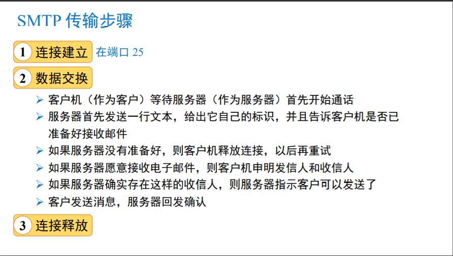
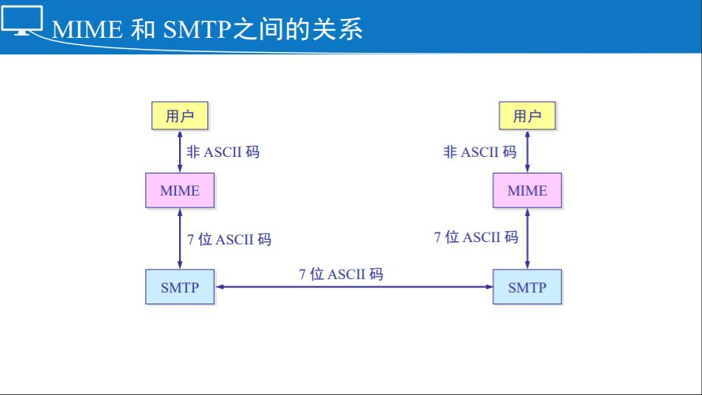
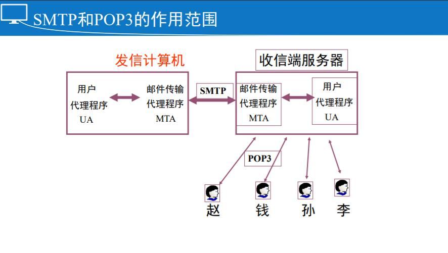
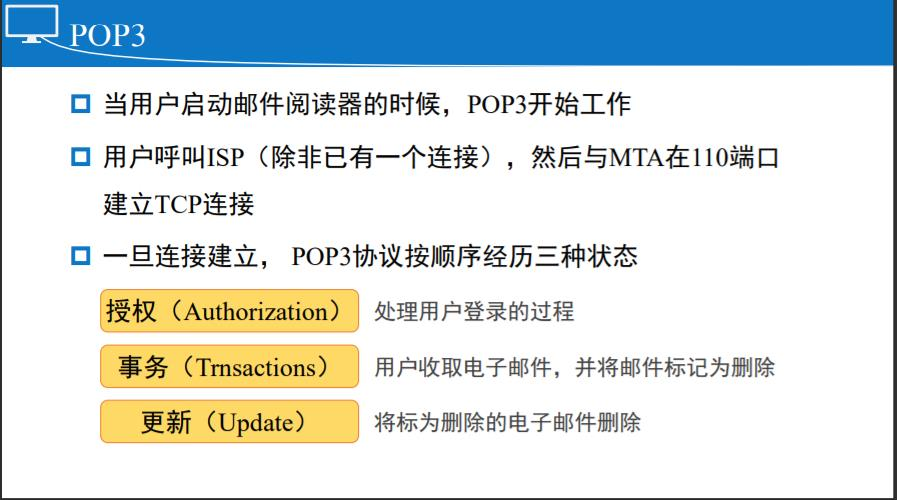
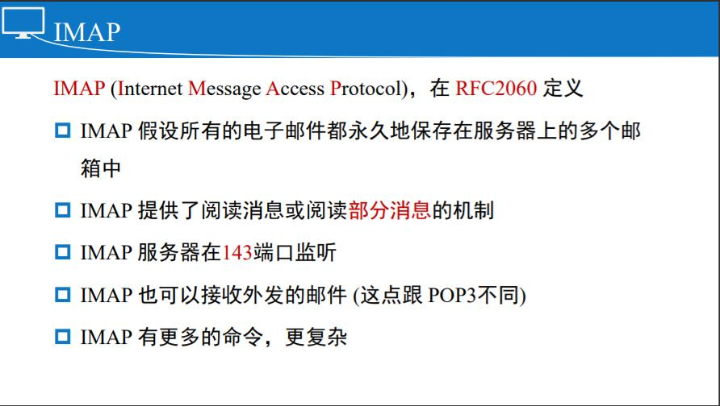
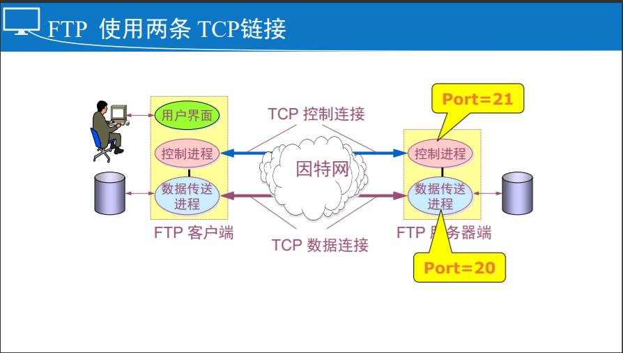

# 第七章：应用层

## 应用层概述

应用层为模型外的用户服务，提供各式各样、 丰富、变幻无穷的应用

最靠近用户的一层，向应用程序提供网络通信

### 应用层特点

- 没有应用层，便没有网络通信支持
- 参考模型中唯一不需要为它的上层服务的一层
- 应用层向参考模型之外的用户提供服务
- 网络应用程序可以分为两大类：直接网络应用程序（微信，多媒体 Multimedia，App，DNS，浏览器 Browser，电子邮件 E-mail，文件传输 FTP，远程登录 Telnet ）；间接网络应用程序（Word字处理软件，资源管理器）

### 重定向器（Redirector）

- 间接网络应用依靠 -- 重定向器（Redirector）实现网络功能
- 重定向器是至于应用中的一种小软件

### 总结

应用层为模型外的用户服务，提供各式各样、 丰富、变幻无穷的应用

两类：

- 直接的网络应用
- 间接的网络应用：重定向器

主要的直接应用有：电子邮件、远程登陆、 Web应用、文件传输……

## 域名系统 DNS 概述（Domain Name System）

在互联网中，使用IP地址作为机器的绝对地址，是行不通的， 有两个原因：

- 计算机可能常常地更换IP地址（位置变化，通过 DHCP 获得不同地址），所以通过IP地址去访问某台机器就会发生问题
- IP地址难于记忆

报文里面没有域名

ARPANET时代，有一个文件hosts.txt，列出了当时网络上所 有的主机和它们对应的IP地址（当网络很小的时候，可以工 作得很好）

### DNS 名字空间

- **DNS是分层次的，基于域的命名方案，且采用了分布式数据库系统来实现**
- 互联网被分成200多个顶级域（每个域被分成若干子域，子域还可进一步划分；所有这些域可以用一棵树来表示，树上的叶子代表没有子域的域（但包含主机）。一个叶子节点可以只包含一台主机，也可以代表一个 公司，包含上千台主机）
- 顶级域分为两种：通用域（generic）国家域（country） 
- 顶级域名由 ICANN 委任的注册机构负责运行

### 域名（Domain Names）

每个域的名字是：从它向上到根（未命名）的路径，各个部 分间用圆点隔开

域名可以是绝对的，也可以是相对的，绝对域名总是以圆点 结束（如： eng.sun.com. ）

- 相对域名必须在一定的上下文环境中被解释出来才有意义， 从而唯一地确定其真实的含义
- 绝对域名和相对域名都引用了域名树中一个特定的节点，以 及它下面的所有节点

域名是大小写无关的（ case insensitive ）

各组成部分的名字最多有 63 个字符长，整个路径不超过 255 个字符

没有规则限制同时在两个或多个顶级域名下的注册 (如： sony.com and sony.nl)—域名抢注

每个域自己控制它下面的域（子域）的划分

- 例如：日本的 ac.jp 和 co.jp 分别对应于 edu 和 com
- 荷兰却不这样区分，它把所有的都放在nl之下

要创建一个新的域，创建者必须得到该新域的上级域的许可， 一旦创建成功，该新域可以创建子域，而无需征得上级域的 同意

域名遵循的是组织的边界而不是物理网络的边界

### 资源记录（Resource Records）

每个域，无论是单主机域还是顶级域，都可以有一组跟它相关联的资源记录（ Resource Records ）

当一个解析器把域名传递给DNS时，DNS所返回的是与该域名相关联的资源记录。**所以DNS的主要功能是将域名映射到资源记录上**

一个资源记录包括五个部分：

1. 域名 Domain name：指出这条记录适用于哪个域（通常，每个域有多条记录，而数据库则保存了多个域的信息；域名字段是匹配查询条件的主要关键字；记录在数据库中的顺序是无关紧要的）
2. 生存时间 Time to Live：指示该条记录的稳定程度（极稳定的信息会被分配一个很大的值，如 86400 （一天时间 的秒数）；非常不稳定的信息会被分配一个很小的值，如60 （1分钟））
3. 类别 Class：对于互联网信息，它总是 IN
4. 类型 Type：指出了这是什么类型的记录（A -- IPv4，B -- IPv6）
5. 值 Value

### 域名服务器

- 整个互联网需要多台而不是一台域名服务器
- DNS名字空间被分割成不相交的区域（zones），每个区域包含域名树的一部分，也包含一台主域名服务器（ primary name server ）
- 主域名服务器从自己硬盘的一个文件中读取信息，次域名服务器（ secondary name servers ）分享这些信息

权威域名服务器是一个从自己的数据满足查询，而无需引用其他来源。除非它*也是*一个递归名称服务器。

### 根域服务器—最高级域名服务器

- 最重要的域名服务器；存储所有顶级域名的名字和IP
- 无论是哪个本地域名服务器，无论何时，只要它无法回答一 个查询请求，它都会向根域服务器求救 (for help)
- 全球有 13 根域服务器，它们的名字分别是a to m（前13 个字 母）
- 到 2006 年底全世界已经安装了一百多个根域名服务器，分布在世界各地
- 这样做的目的是为了方便用户，使世界上大部分 DNS 域名服务器都能就近找到一个根域名服务器

### 总结

因为IP地址难以记忆，且IP地址经常发生变动，所以，出现了域名

DNS是一个层次化的分布式数据库系统，提供域名解析服务。

资源记录：

- 权威资源记录
- 域名服务器

## DNS 之域名解析

域名服务器将域名映射为 IP 地址的方法和过程就叫做域名解析

### DNS 的使用方法

1. 为了将一个名字映射为IP地址，应用程序调用一个叫解析器 （ resolver ）的库过程，把名字作为参数传递给这个过程 （如： gethostbyname()就是一个解析器）
2. 解析器发送一个UDP分组给本地DNS服务器，它会负责查找该名字， 然后将对应的IP地址返回给解析器
3. 解析器返回结果给应用程序，然后应用程序即可开始工作了（封装， 发送……）

### 域名解析

当一个解析器收到一个域名查询时，它将该查询传递给本地的一个域名服务器

如果待查询的域名落在该名字服务器的管辖范围内，它将返回权威资源记录（一个权威资源记录（authoritative record）是指来自于管理该记录的权威机构，因此总是正确的，它和缓存的记录不同， 后者可能是过期的）

如果被请求的域名是远程的，且本地没有关于它的信息，那么本地名字服务器向根域服务器发送一条查询此域的消息

### 域名解析的种类

**一次完整的域名解析包括递归解析和迭代解析**

主机向本地域名服务器：查询一般都是采用递归查询

1. 主机所询问的本地域 名服务器不知道被查 询域名的 IP 地址
2. 本地域名服务器以 DNS 客户 的身份，向其他根域名服务 器继续发出查询请求报文

本地域名服务器向根域名服务器：查询通常是采用迭代查询

1. 根域名服务器收 到本地域名服务器的迭代查询请 求报文
2. 查询到的话给出所要查询的 IP 地址
3. 查询不到的话告诉本地域名服务 器：“你下一步应 当向哪一个域名服务器进行查询”；本地域名服务器进行后续的查询

### 优化方法

高速缓存—减少查询环节，提高效率

- 本域中的另一台主机如果查询同一个域名，则马上可得到结果
- 本域中的另一台主机如果查询另一个域名，则可直接发送到权威域名服务器得到权威记录

**缺点：通过各级缓存优化查询结果，所获得的解析结果可能无效**

### 什么时候使用能够 TCP

UDP报文超过512Bytes

- 对首次请求响应，返回参数TC置位
- 再请求，建立TCP连接，将数据流分段发送

从(second)服务器的数据更新

- 主、从 服务器间建立TCP连接
- 进行批量数据流传输

### 总结

域名解析是将域名映射为IP地址的方法和过程

一次完整的域名解析包括递归解析和迭代解析

通过各级缓存优化查询，所获得的解析结果可 能无效

 DNS存在不安全的因素

## 电子邮件

电子邮件系统通常由两部分组成：

- **用户代理(UA)：主要负责读写邮件**，让用户能够阅读和发送邮件（本地程序，提供命令行或图形界面，让用户和电子邮件系统交互）
- **消息传输代理 (MTA)：主要负责收发邮件**，将消息从源端送到目标端（通常是系统守护进程，又被称为邮件服务器，即运行在后台的进程，在系统中传递电子邮件）

### 用户代理

 一个程序（电子邮件阅读器）

Gmail、Thunderbird、Outlook、Foxmail

用户代理完成的功能：

- 入境邮件的显示
- 归档：垃圾邮件、某重要人物的邮件
- 邮件处置：回复、转发、删除、保存……
- 自动响应
- 签名块
- 邮件列表（mailing-list）：本地、传输代理

### 电子邮件消息格式

**ASCII 电子邮件信息通常采用 RFC 822**

- 消息由一个基本的信封 (RFC821)、一些头域、一个空行和消息体组成
- 每个头域（逻辑地）由一行ASCII文本组成，包括域名、一个冒号，对 于大多数头域来说，还包括一个值
- RFC822是几十年前设计的，没有区分信封域和头域（虽然 RFC 2822作了修正，但是因为RFC822已经广泛使用，完全重新 设计是不可能的）
- 用户可以发明新的消息头以供自己私人使用，只要这些消息头以 X-开头

**非纯文本邮件：MIME – the Multipurpose Internet Mail Extensions（多用途互联 网邮件扩展**）

- 解决这些问题：带有重音符的语言（如法语）、非拉丁字母（如俄 语）、不带字母的语言（如汉语）、完全不包含文本的消息（如视频）
- RFC1341提出了解决方案，并在 RFCs 2045-2049中修改

MIME的基本思想是继续使用 RFC 822格式，但是在消息体中 增加了结构，且为非ASCII消息定义了编码规则

- 由于没有偏离 RFC822，MIME 消息可以使用现有的程序和协议来发送
- 所有必须要改变的是接收和发送的程序

### MIME 增加的信息头

内容传输编码（Content-Transfer-Encoding）指出了如何包装消息体，各种编码方案 （加上一个扩充新方案的选项）Base64 编码，有时被称为ASCII盔甲（ ASCII armor）

- 每24位成一组，每组分成4个6位单元，每个单元被当作一个合法的 ASCII字符来发送
- “A” 代表 0， “B”代表 1， 以此类推，接着是26位小写字母，10 个数字，最后是 + 和 / 分别代表 62 和 63
- == 和 = 分别表示最后一个组只含有8位或16位
- 回车和换行被忽略

Content-Type：指定消息主体的本质特性，RFC 1521中定义了7种类型，每种有一个和多个子类

RFC 2854增加了一个子类 text/html

RFC 3023 为扩展标记语言增加了 text/xml 子类

### Email 消息传输

消息传输系统专注于将消息从发信方转发给收信方（可以这样完成上述功能：建立一个从源机器到目标机器间的传输层连 接，然后传输消息）

SMTP – Simple Mail Transfer Protocol

- 源机与目标机（SMTP守护进程在监听）的25端口建立TCP连接
- 如果消息不能被投递，则向消息的发送方返回一个错误报告（包含了 不能投递消息的第一部分）
- 这是一个简单的 ASCII 协议

### SMTP 传输步骤

### SMTP 存在的问题

1.  没有认证
2. 传输的是ASCII消息而不是二进制数据，需要编码，效率低下
3. 邮件是明文
4. RFC2821 定义了 ESMTP (Extended SMTP)（使用ESMTP的用户首先发送 EHLO消息，而不是HELO消息）

### 最后传递

假设所有的收发邮件的机器都一直处于工作状态

当有用户使用拨号上网，不可能一直在线的时候，上述工作 模式不再运作了

在ISP的一台机器上运行一个消息传输代理（message transfer agent）； 这台机器可以一天24小时运行，随时都可以接收邮件

设计一个协议（POP3 (Post Office Protocol Version 3), RFC 1939），允许用户和消息传输代理MTA联系，然 后把邮件从ISP那里拷贝到用户

### POP3

### IMAP

### Webmail

能上网即可用无须配置，浏览器即可 容量有限(163，新浪邮箱等)

### 总结

电子邮件系统主要包括MTA和UA两部分

- UA主要负责读、写邮件
- MTA主要负责收发邮件

邮件传输协议：SMTP

非纯文本邮件：MIME（多用途互联网邮件 扩展）

最后一跳

- POP3
- IMAP

## 万维网

1989年，Web (也叫 WWW)诞生于欧洲原子能中心 CERN

1994年，CERN 和 M.I.T. 签署了建立万维网联盟 （World Wide Web Consortium，W3C） 的协议，致力于进一步开发 Web、协议标准化和站点互操作等

**Web 是web网页的集合（ collection of web pages）**

每个页面包含了指向其他页面的链接（超级链接）

浏览器 –显示阅读web页面的程序

Web之父 -- Tim Berners-Lee

1989年仲夏之夜，蒂姆成功开发出世界上第 一个Web服务器和第一个Web客户机

### WWW 的组成部分

-  资源，web页面，Resource (html)
-  统一资源定位器：URL
- 通信协议 HTTP

### 比较WWW和互联网（internet）

Internet 是基础，Web 是应用。

通常浏览网页就是在使用万维网，而邮件、ftp、上qq等就不是在使用万维网，但是在用的是互联网

### Web 页面的组成

Web页面由 URL (Uniform Resource Locators)标识 (i.e. http://www.abcd.com/products.html)

- 协议：http
- 页面所在的机器的 DNS 域名：www.abc.com
- 包含web页面的文件的名字：products.html

### 客户端

当用户单击一个超级链接（URL）时：

- 浏览器检查URL (读取浏览器的输入) 
- 浏览器向 DNS 服务器询问域名的IP地址 
- DNS 返回对应的 IP 地址
- 浏览器和Web服务器建立TCP 连接（在端口 80）
- 浏览器发送请求，要求获取文件products.html
- Web服务器返回被请求的文件
- TCP 连接被释放
- 浏览器解释显示下载到本地的文件

一个web页面可能由PDF文件、GIF图标、MPEG视频、MP3歌 曲，或者其他数百种文件类型的任何一种组成

浏览器可能在解释这些文件的时候会遇到问题，不是让浏览 器越来越大，而是采用了一个更加通用的解决方案

当服务器返回一个页面，它通常也返回一些有关该页面的附 加信息，包含了页面的MIME类型，以决定如何显示该页面

有两种可能扩展浏览器的方式：

- 插件，代码模块，运行在浏览器的内部
- 独立的程序，浏览器只是把参数传入

### 服务端

典型的 web 服务器的操作：

- 接收来自客户的TCP连接
- 获取所需文件的名字
- 从本地磁盘上获取文件（静态页面）
- 将文件返回给客户
- 释放TCP连接

改进：

- 在内存维护一个缓存，保存最近用过的 n个文件
- 多线程服务器

**客户的TCP连接中止于前端，所以应答也必须经过前端**

- 一种解决的方法是TCP移交，TCP端点被传递给处理节点 ， 所以应答可以直接向客户端发送

### 高速代理服务器

代理服务器(proxy server)又称为万维网高速缓存(Web cache)， 它代表浏览器发出 HTTP 请求。

万维网高速缓存把最近的一些请求和响应暂存在本地磁盘中。

当与暂时存放的请求相同的新请求到达时，万维网高速缓存 就把暂存的响应发送出去，而不需要按 URL 的地址再去因特 网访问该资源。

### Cookie

存在原因：

- 不同的用户登录同一个web服务器，想获得不同的资源：个性化服务
- eg：一个电子商城，服务器如何跟踪购物车上的项目？一个门户网站，如何向定制的用户推送不同的信息？

定义：

- 一个小于4kB的命名串
-  当客户请求时，web服务器除了应答外，附送一个cookie，存储在客户机磁盘
- 客户再访问同一个web服务器时，同时发送cookie
- 服务器辨识出该用户，并得到它关心的一些信息
- 方便的同时，有可能侵犯了用户的隐私

### 总结

WWW的三个组成部分

- 资源
- 资源定位器
- 传输协议

WWW的传输层使用了TCP

浏览器解释资源的不同方式：内嵌插件或外挂

TCP移交缓解了前端的压力

## 其它应用

经典应用：文件传输、远程登录、电子邮件......

新应用：实时视频、微信......

### 文件传输

一种可靠的面向连接的服务，采用 TCP 在支持 FTP （File Transfer Protocol）的系统间传输文件，它支持双向二进制文件和 ASCII 文件传输。

TFTP（Trivial File Transfer Protocol）：一种无连接的不可靠的服务，采用 UDP 在支持 TFTP 的系统间传输文件。eg：路由器在备份配置文件的时候

上载：将文件从自己的计算机中拷贝到远程计算机上(upload)

下载：将文件从远程计算机上拷贝到自己的计算机上。 (download)

### FTP

使用方式：

- 字符界面：常用的字符命令，get、put等
- 专用程序：cuteFTP、leapFTP
- 普通浏览器

### 远程登录 Telnet

不要求远地系统创建众多的服务器，只需为每个远程登陆用 户建立一个进程，这个进程再通过创建子进程为远程登陆用 户提供各种允许的服务

远程登陆的另外一个优点，它提供与本地登陆几乎完全相同 的用户界面

本地用户在本地终端对远地系统进行远程登陆，该远程登陆 的内部视图实际上是一个TCP连接（服务器端口：23）

将本地终端上的键盘输入逐键传到远地机

将远地机输出送回本地终端

使用方法：

- 视窗下的使用：Cmd、telnet ip/DN
- Unix下的使用：Telnet address
- 使用专用软件：Neterm、CSTelnet

SSH：Secure Shell，在22端口，它可以为远程登录这样的明文传输协议提供安全的传输壳

### 多媒体应用

分为实时视频应用，非实时视屏应用两大类

### 总结

FTP有两根TCP连接

- 数据连接（20） 
- 控制链接（21）

远程登录TELNET工作在23端口

- SSH工作在22端口

FTP和TELNET的传输层都用的是TCP

多媒体应用丰富多彩

- 实时
- 非实时