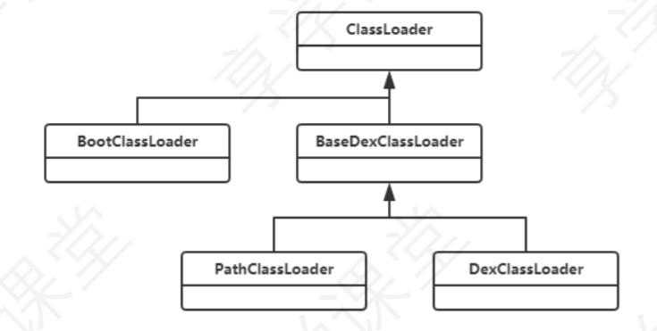

# ClassLoader原理

Java 源码文件编译后会生成一个 class 文件，而在 Android 中，将代码编译后会生成 一个 apk 文件，将 apk 文件解压后就可以看到其中有一个或多个 classes.dex 文件，它就是安卓把所有 class 文件 进行合并，优化后生成的。 Java 中 JVM 加载的是 class 文件，而安卓中 DVM 和 ART 加载的是 dex 文件，虽然二者都是用的 ClassLoader 加载的，但因为加载的文件类型不同，还是有些区别的，所以接下来我们主要介绍安卓的 ClassLoader 是如何加载 dex 文件的

## ClassLoader实现类

ClassLoader是一个抽象类，实现类主要分为两种类型：系统类加载器和自定义加载器

- BootClassLoader 用于加载Android Framework层class文件
- PathClassLoader 用于Android应用程序类加载器。可以加载指定的dex，以及jar、zip、apk中的classes.dex
- DexClassLoader 用于加载指定的dex，以及jar、zip、apk中的classes.dex

根据源码了解到，PathClassLoader 和 DexClassLoader 都是继承自 BaseDexClassLoader，且类中只有构造方法，它们的类加载逻辑完全写在 BaseDexClassLoader 中。 

其中我们值的注意的是，在8.0之前，它们二者的唯一区别是第二个参数 optimizedDirectory，这个参数的意思是 生成的 odex（优化的dex）存放的路径，PathClassLoader 直接为null，而 DexClassLoader 是使用用户传进来的 路径，而在8.0之后，二者就完全一样了。

应用程序类是由 PathClassLoader 加载的，Activity 类是 BootClassLoader 加载的，并且 BootClassLoader 是 PathClassLoader 的 parent，这里要**注意 parent 与父类的区别**

那我们如何使用类加载器去加载一个类呢？DexClassLoader 类中没有 loadClass 方法，一路向上查找，最后在 ClassLoader 类中找到了改方法

## 双亲委托机制

首先检测这个类是否已经被加载了，如果已经加载了，直接获取并返回。如果没有被加载，parent 不为 null，则 调用parent的loadClass进行加载，依次递归，如果找到了或者加载了就返回，如果即没找到也加载不了，才自己 去加载。这个过程就是我们常说的**双亲委托机制**

BootClassLoader 是最后一个加载器，所以我们来看下它是如何结束向上递归查找的

 BootClassLoader 重写了 findClass 和 loadClass 方法，并且在 loadClass 方法中，不再获取 parent， 从而结束了递归。

接着我们再来看下，在所有 parent 都没加载成功的情况下，DexClassLoader 是如何加载的。通过查找我们发现 在它的父类 BaseDexClassLoader 中，重写了 findClass 方法