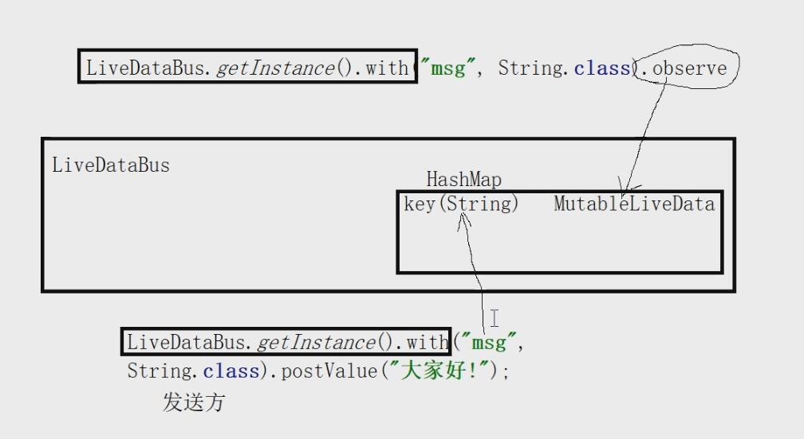

# fragment之间是如何通信的

从18年谷歌IO大会开始官方建议在

Activity与Activity

Activity与Fragment

Fragment与Fragment

之间通信使用LivedataBus


## 使用

```java
//发送消息
LiveDataBus.getInstance().with("msg", String.class).postValue("大家好!");
```

```java
//定义一个接收数据的观查者
LiveDataBus.getInstance().with("msg", String.class).observe(
    this, new Observer<String>() {
        @Override
        public void onChanged(String msg) {
            if(msg!=null){
                Toast.makeText(getContext(), msg, Toast.LENGTH_SHORT).show();
            }
        }
    }
);
```


## 原理

