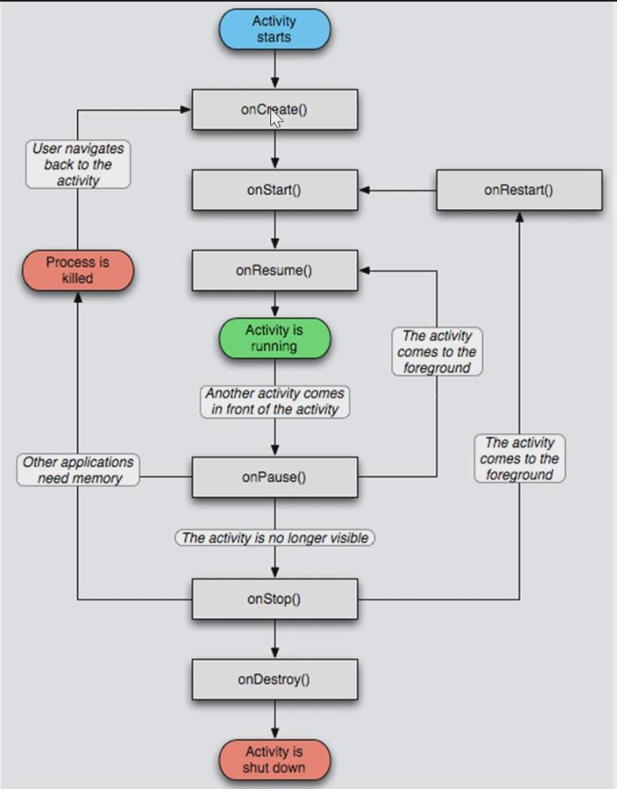

# Activity的生命周期

- onCreate()：初始化资源，setContentView()，第三方SDK的注册等等，尽可能进行延迟加载或懒加载，让做的事情少，这样Activity启动的速度会快一些
- onStart()：Activtiy变为可见状态，但此时无法和用户进行交互，也可以做一些初始化操作
- onResume()：整个 Activtiy 准备恰好和用户进行交互的时候调用，在回到该 Activtiy 的时候做一些数据恢复或相关的工作
- onPause()：Activity 由可见变为部分不可见的时候执行
- onStop()：当前 Activity 完全不可见的时候执行

## 异常恢复

当 App 退到后台执行，系统内存不够导致 App 被 kill，为了确保之后数据进行恢复，使用 onSaveInstanceState() 将数据保存在Android中，在 onRestoreInstanceState() 或 onCreate() 中恢复数据