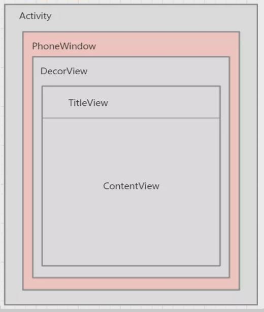

# Activity、View与Window的关系

Activity 一被创建会执行 attach() 方法，该方法里会创建一个 PhoneWindow

Activity 的 setContentView() 是调用了 PhoneWindow 的 setContentView() 先创建了 DecorView，再把我们的 LayoutResID 设置进 ContentView 将 View 显示出来

- **Activity：**四大组件之一，是存放 View 对象的容器，也是我们界面的载体，可以用来展示一个界面，它有一个 setContentView() 方法，可以将我们定义的布局设置到界面上显示
- **View：**就是一个个视图的对象，实现了 KeyEvent.Callback 和 Drawable.Callback
- **Window：**是一个抽象类，是一个顶层的窗口，它的唯一实例是 PhoneWindow，它提供了标准的用户界面策略对 View 的管理，如背景、标题、区域、默认按键处理等等

