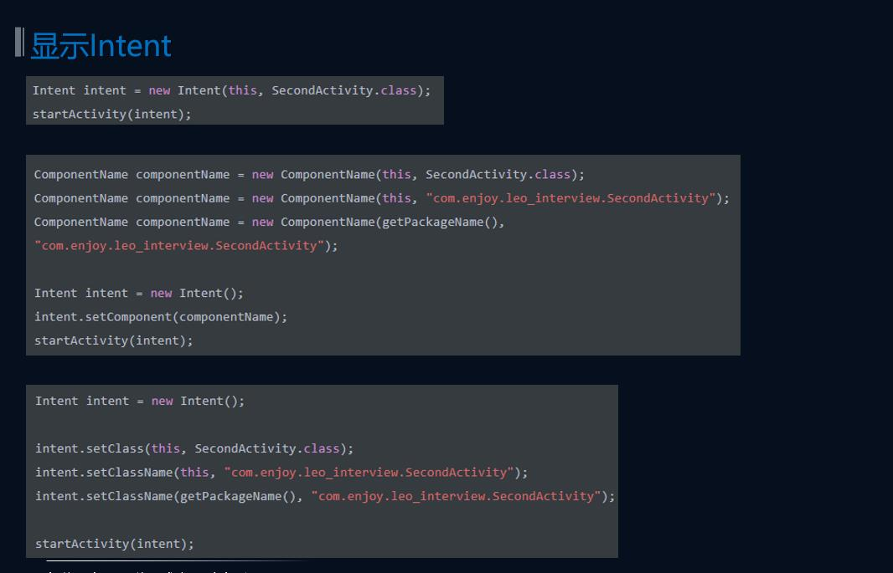
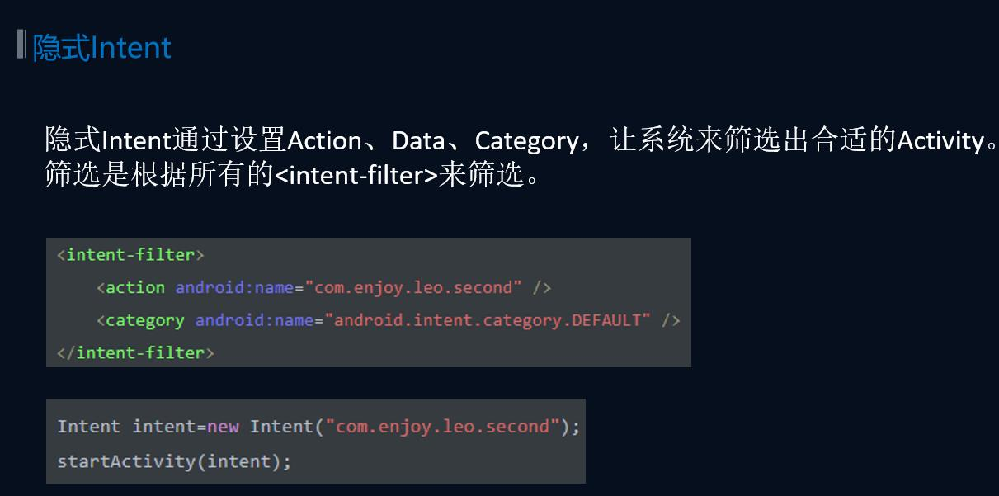

# 解释一下Android中的Intent(隐式&显式)


## 显示Intent

显示Intent是明确目标Activity的类名。

**使用方法：**

1. 通过Intent(Context packageContext, Class<?> cls)构造方法
2. 通过构造ComponentName并将实例传入Intent的setComponent()方法
3. 通过Intent的setClass/setClassName方法，原理也是通过创建ComponentName实例




## 隐式Intent

隐式Intent通过设置Action、Data、Category，**让系统来筛选出合适的Activity**。筛选是**根据所有的<intent-filter>来筛选**。

使用隐式 Intent，我们不仅可以启动自己程序内的活动，还可以启动其他程序的活动，这使得 Android 多个应用程序之间的功能共享成为了可能



注意：

每个 Intent 中只能指定一个 action，但却能指定多个 category

当在活动中添加一个 category 直接运行的话会遇到程序崩溃，因为没有任何响应我们的 Intent，当在 SecondActivity 的 <intent-filtert> 标签中再添加一个 category 的声明，再次重新运行就正常了

```java
button1.setOnClickListener(new View.OnClickListener(){
    @Override
    public void onClick(View v){
        Intent intent = new Intent("com.example.activitytest.ACTION_START");
        intent.addCategory("com.example.activitytest.MY_CATEGORY");//该方法添加一个 category
        startActivity(intent);
    }
});
```

```java
<activity android:name=".SecondActivity">
    <intent-filter>
        <action android:name="com.example.activitytest.ACTION_START"/>
        <category android:name="android.intent.category.DEFAULT"/>
        <category android:name="com.example.activitytest.MY_CATEGORY"/>//添加一个 category 声明
    </intent-filter>
</activity>
```


## 隐式Intent其他用法

setData()：接收一个 Uri 对象，主要用于指定当前 Intent 正在操作的数据， 而这些数据通常都是以字符串形式传入到 Uri.parse() 方法中解析产生的

我们还可以在 <intent-filter> 标签中在配置一个 <data> 标签，用于更加精确地指定当前活动能够响应什么类型的数据。<data> 标签中主要可以配置一下内容

+ android:scheme。用于指定数据的协议部分，如上例中的 http 部分
+ android:host。用于指定数据的主机名部分，如上例中的 www.baidu.com 部分
+ android:port。用于指定数据的端口部分，一般紧随在主机名之后
+ android:path。用于指定主机名和端口之后的部分，如一段网址中那个跟在域名之后的内容
+ android:mimeType。用于指定可以处理的数据类型，允许使用通配符的方式进行指定

只有 <data> 标签中指定的内容和 Intent 中携带的 Data 完全一致时，当前活动才能够响应该 Intent 。不过一般在 <data> 标签中都不会指定过多的内容

```java
button1.setOnClickListener(new View.OnClickListener(){
    @Override
    public void onClick(View v){
        //首先制定了 Intent 的 action 是 Intent.ACTION_VIEW，这是一个 Android 系统内置的动作，其常量值为 android.intent.action.VIEW
        Intent intent = new Intent(Intent.ACTION_VIEW);
        //通过 Uri.parse() 方法，将一个网址字符串解析成一个 Uri 对象，在调用 setData() 方法将这个 Uri 对象传递进去
        intent.setData(Uri.parse("http://www.baidu.com"));
        startActivity(intent);
    }
});
```

```java
<activity android:name=".ThirdActivity">
	//配置了当前活动能够响应的 action 和 Intent.ACTION_VIEW 的常量值，而 category 则指定了默认的 category
    <intent-filter>
        <action android:name="android.intent.action.VIEW"/>
        <category android:name="android.intent.category.DEFAULT"/>
        //指定了 http 协议
        <data android:scheme="http"/>
    </intent-filter>
</activity>
```

除了 http 协议外，geo 表示显示地理位置、tel 表示拨打电话

```java
button1.setOnClickListener(new View.OnClickListener(){
    @Override
    public void onClick(View v){
        //指定了 Intent 的 action 是 Intent.ACTION_DIAL，这是 Android 系统的内置动作
        Intent intent = new Intent(Intent.ACTION_DIAL);
        //data 部分指定了协议是 tel ，号码是 10086
        intent.setData(Uri.parse("tel:10086"));
        startActivity(intent);
    }
});
```

