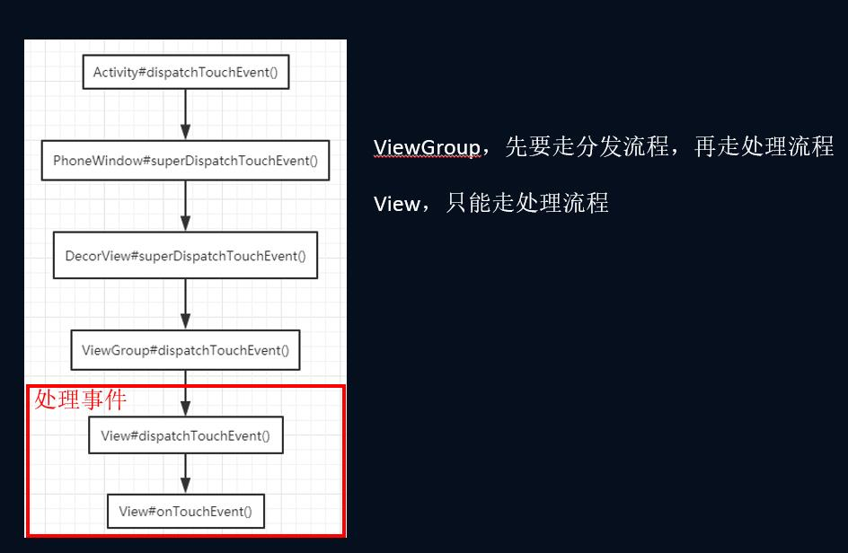

# Touch事件分发机制

## MotionEvent

注意：MOVE事件会走多次

## View继承关系

事件处理都在View的onTouchEvent()，如果处理返回true，不处理返回false

事件分发在ViewGroup的dispatchTouchEvent()，如果拦截返回true，不拦截返回false

## 总流程

## 分发流程

- down 事件相当于确定项目给谁做
- move 事件相当于项目进行中的一些事情处理
- up 事件就是项目完结
- cancel 事件是取消当前人做该项目

## 总结

ViewGroup：先走分发流程，再走处理流程

View：只能走处理流程

分发流程：

1. 先看自己是否拦截，然后自己处理（即不分发事件下去）

2. 自己不拦截，事件分发下去：
   --> 对 child 排序
   --> 遍历 child 是否分发
   --> 领取 View 的处理事件

3. 没人领取，再看自己是否处理事件

   

